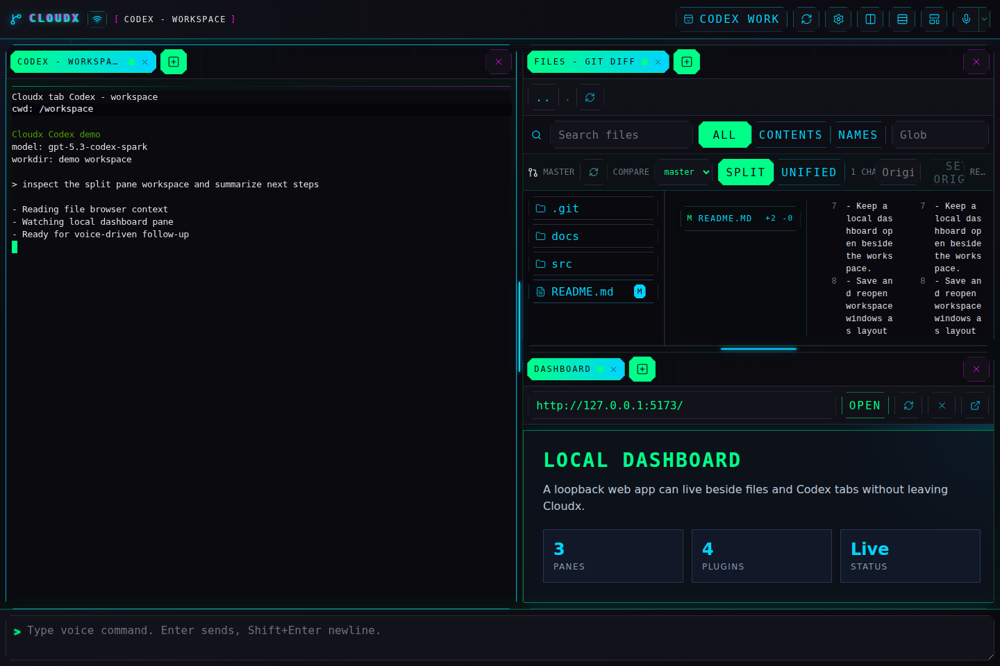
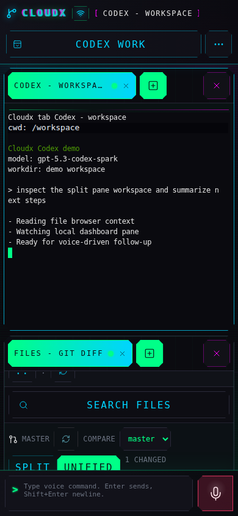

# Cloudx

Cloudx is a local-first web workbench for running Codex CLI sessions from a
laptop or phone, with a mobile-optimized interface for work on the go. It gives
you split panes, plugin tabs, terminal sessions, file tools, local dashboard
viewing, and voice control through local Faster Whisper plus a restricted Codex
planner.

## Status And Disclosure

This project was vibe coded and is meant for other people experimenting with
vibe coding workflows. It is useful, but it is not a hardened service.

Do not expose Cloudx to the public internet. It can spawn terminals, send text
to shells and Codex, read and edit files under configured roots, and embed local
dashboards with token-bearing URLs. Use localhost, a trusted LAN, or a private
tailnet only.

## Screenshots

These screenshots use a throwaway demo workspace and avoid local paths, host
names, and dashboard tokens. Regenerate them with `npm run docs:screenshots`.





## Features

- Responsive desktop and phone UI tuned for quick mobile sessions.
- Server-backed workspace windows with independent pane layouts, default work
  directories, quick name search, and AI-assisted context search.
- tmux-like panes with movable plugin tabs.
- Layout templates that save the current pane/tab arrangement and reopen it on a
  different project path.
- Codex terminal and standard shell terminal plugins.
- File browser plugin with voice-exposed read/write actions, active file search,
  optional Git setup controls, changed-file badges in the tree, and rendered
  per-file diffs.
- Worktree manager plugin for creating or cloning a bare repository and managing
  project worktree folders.
- Local web plugin for dashboards such as Understand Anything.
- Dynamic settings for global AI/microphone controls and plugin-owned options
  such as file-browser Git diff visibility.
- Shared path autocomplete for tab, window, and template directory fields.
- Voice control using browser audio, local Faster Whisper, and
  `gpt-5.3-codex-spark`.
- HTTPS on port `3001` with a local self-signed certificate for microphone
  access.

## Repository Map

- `apps/server`: Fastify server, plugin host, sessions, terminals, local-web
  proxy, ASR bridge, and voice controller.
- `apps/web`: React/Vite UI.
- `packages/plugin-api`: plugin contracts.
- `packages/shared`: shared domain types and validation helpers.
- `services/asr`: local Faster Whisper service.
- `docs/MOTIVATION.md`: why this exists.
- `docs/WEB_APP_PLAN.md`: product and architecture plan.
- `docs/SETUP.md`: install, service, HTTPS, and ASR details.

## Quick Start

```bash
npm install
npm run build
npm run dev
```

Open `https://127.0.0.1:3001`. For phone access, trust the generated local
certificate on the client device or proxy Cloudx through a private tailnet.

For voice control:

```bash
python3 -m venv services/asr/.venv
services/asr/.venv/bin/pip install -e services/asr
services/asr/.venv/bin/uvicorn cloudx_asr.main:app \
  --app-dir services/asr/src --host 127.0.0.1 --port 7810
```

The ASR service defaults to the small CPU model. See `docs/SETUP.md` for the
large-v3 Faster Whisper setup and systemd service install.

## Configuration

Common environment variables:

- `CLOUDX_HOST`: bind address, default `0.0.0.0`.
- `CLOUDX_PORT`: app port, default `3001`.
- `CLOUDX_ALLOWED_ROOTS`: path-delimited allowed roots, default `~`.
- `CLOUDX_ASR_URL`: ASR endpoint, default `http://127.0.0.1:7810`.
- `CLOUDX_VOICE_MODEL`: planner model, default `gpt-5.3-codex-spark`.
- `CLOUDX_VOICE_DEBUG_TRANSCRIPTS`: log raw transcripts and planner text.

## Verify

```bash
npm run typecheck
npm test
npm run build
services/asr/.venv/bin/python -m pytest services/asr/tests
```

## License

MIT. Forks and copies must keep the copyright and license notice, which credits
the original author.
