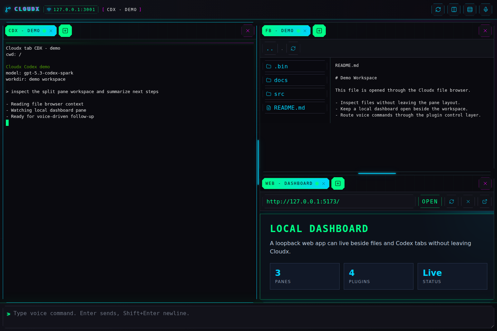
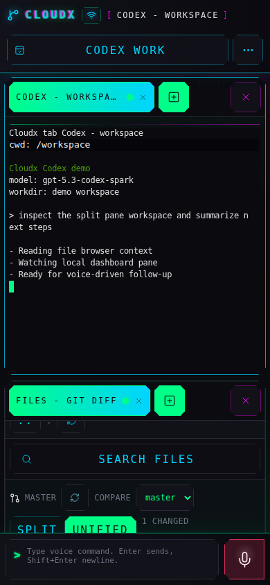

# Cloudx

Cloudx is a local-first mobile workbench for Codex CLI. Run and supervise Codex CLI from your phone on your own Linux build machine, with local-first sessions, panes, file tools, diffs, worktrees, and constrained voice control.

Cloudx is built for long-running agent work: multiple Codex terminals, split
panes, file browsing, rendered diffs, worktree management, local dashboard
previews, and constrained voice commands backed by local Faster Whisper.

Cloudx is intentionally local-first. Your code, credentials, shell tools, and
Codex login stay on your machine. Private by default. Tailnet recommended.
Public internet unsupported.

Do not expose Cloudx to the public internet. It can spawn terminals, send text
to shells and Codex, read and edit files under configured roots, and embed local
dashboards with token-bearing URLs. Keep Cloudx on localhost and put an
authenticated reverse proxy such as Tailscale Serve in front of it for remote
access whenever possible. An explicit `0.0.0.0` bind is available for a trusted,
firewalled LAN, but Cloudx does not authenticate direct LAN clients.

## Screenshots

These screenshots use a throwaway demo workspace and avoid local paths, host
names, and dashboard tokens.

### Desktop Workspace



### Mobile Portrait

<p align="center">
  
</p>

## Features

- Responsive desktop and phone UI tuned for quick mobile sessions.
- Server-backed workspace windows with independent pane layouts, default work
  directories, quick name search, and AI-assisted context search.
- tmux-like panes with movable plugin tabs.
- Layout templates that save the current pane/tab arrangement and reopen it on a
  different project path.
- Codex terminal and standard shell terminal plugins, including clipboard image
  paste into Codex tabs as workspace-backed `@` file references.
- File browser plugin with voice-exposed read/write actions, active file search,
  optional Git setup controls, changed-file badges in the tree, and rendered
  per-file diffs.
- Worktree manager plugin for creating or cloning a bare repository and managing
  project worktree folders.
- Local web plugin for dashboards such as Understand Anything.
- Jira plugin for Jira Cloud issue dashboards, comments, transitions, issue
  links, browser links, helper skills, and automation triggers from polling or
  a manual play action in the Jira panel.
- Documentation archive plugin for portable local knowledge ingestion, search,
  source viewing, invalidation, assisted answers, queued imports, and automatic
  Codex rule/skill injection.
- Dynamic settings for global AI/microphone controls and plugin-owned options
  such as file-browser Git diff visibility.
- Shared path autocomplete for tab, window, and template directory fields.
- Voice control using browser audio, local Faster Whisper, and
  `gpt-5.3-codex-spark`.
- HTTPS on port `3001` with a local self-signed certificate for microphone
  access.

## Repository Map

- `apps/server`: Fastify server, plugin host, sessions, terminals, local-web
  proxy, ASR bridge, and voice controller.
- `apps/web`: React/Vite UI.
- `packages/plugin-api`: plugin contracts.
- `packages/shared`: shared domain types and validation helpers.
- `services/asr`: local Faster Whisper service.
- `services/documentation-indexer`: local FastAPI documentation archive indexer,
  extraction pipeline, and retrieval tests.
- `debug_tooling/documentation-validation`: optional validation runner for the
  documentation archive.
- `containers/ci`: credential-free no-network verifier image.
- `docs/AI_CHANGE_PROCESS.md`: repository state, artifact, review, and merge
  contract consumed by external AI automation.
- `docs/MEMORY_PLUGIN_GUIDE.md`: source-grounded documentation archive guide.
- `docs/MOTIVATION.md`: why this exists.
- `docs/WEB_APP_PLAN.md`: product and architecture plan.
- `docs/SETUP.md`: install, service, HTTPS, and ASR details.
- `docs/SECURITY_MODEL.md`: threat model, current limits, and deployment guidance.

## GitHub Plugin Metadata Installs

Cloudx can install plugin metadata from a public or credential-helper-backed
GitHub HTTPS repository:

```bash
curl -sS -X POST http://127.0.0.1:3001/api/plugins/install \
  -H 'content-type: application/json' \
  -d '{"url":"https://github.com/owner/repo"}'
```

The repository must contain `.cloudx-plugin/plugin.json`:

```json
{
  "schemaVersion": 1,
  "id": "example-plugin",
  "acronym": "EXP",
  "displayName": "Example Plugin",
  "description": "Short plugin description."
}
```

Installed GitHub plugins are enabled as non-creatable placeholder descriptors
after metadata validation. Cloudx does not execute third-party plugin code in
this install path.

## Jira Integration

Cloudx includes a built-in Jira Cloud plugin. Configure it in Settings > Jira
with the Jira site URL, Atlassian account email, and Jira API token. The token is
stored as a plugin secret outside normal `config.json` and is not returned by
`/api/config`.

Create a Jira tab to view assigned work grouped by Epic by default. The panel can
refresh dashboard issues, open Jira browser links, view comments and transitions,
add comments, transition issues, and fire the `jira.issueManualRun` automation
trigger from an issue row.

Jira hooks expose search, bounded all-page search, current user, metadata, issue
read/write, comments, transitions, links, URL generation, and one-shot polling.
Jira polling is disabled by default. When enabled, Cloudx polls bounded JQL and
emits automation triggers for created, updated, transitioned, newly assigned,
assigned-to-me, and comment-created events.

## Automation Workflows

The Automation tab composes trigger events, plugin hooks, primitives, and
converters into saved graphs. It can run from manual UI triggers such as Jira's
issue play action or from plugin-owned triggers such as Jira polling events.
Poll-based Jira triggers are exposed only to plugins and automation; external
HTTP callers use the explicit manual Jira trigger instead.

Python and Bash execution primitives are available for graph steps that need
custom code. Python code can call automation-exposed Cloudx hooks with
`cloudx.call_hook(...)`; see `docs/AUTOMATION_CODE_EXECUTION.md` for hook ID
format, examples, outputs, and runtime limits.

## Codex Image Paste

Codex terminal tabs accept pasted PNG, JPEG, WebP, and GIF clipboard images.
Cloudx saves each image under `.cloudx/pasted-images/` in the tab workspace and
inserts an `@.cloudx/pasted-images/...` reference into the Codex prompt. Standard
shell terminal tabs do not intercept image paste.

Every Cloudx Codex terminal uses the same managed safety and capability defaults:
Codex runs in explicit `--yolo` mode, local memories and Codex Apps are disabled,
and Agent Plugins are disabled so their skills cannot enter the session. Cloudx
enables only its selected and system skills plus the bundled `imagegen` skill;
user, administrator, and repository skills discovered outside that set are
disabled in the tab's generated Codex home. When the user's base Codex config
omits a model, Cloudx defaults to `gpt-6-astra`. Explicit model, reasoning-effort,
and display preferences are preserved.

Reloading the browser page reattaches the same running terminal tab and restores
its retained output, including a full replay buffer. The terminal process stays
owned by the running Cloudx server. Restarting the Cloudx service ends those
processes; changing a config file does not change the model inside an already
running Codex process.

## Quick Start

On Ubuntu 22.04 or newer, the guided installer is the easiest path:

```bash
git clone https://github.com/davidomil/cloudx
cd cloudx
./install.sh
```

It shows each phase before running it. The bootstrap stage installs Ubuntu
packages, including jq for JSON helper scripts, the PDF, spreadsheet, image,
and media keyframe extraction tools used by the documentation archive plus the
Quarto, Pandoc, and TeX Live toolchain used to render the memory-plugin PDF
guide. It then installs Node.js 22 when needed, verifies `node -v` and
`npm -v`, and falls back to Ubuntu's
`npm` package if npm is still missing. The wizard checks Git 2.36+ for the
Worktree Manager and, on older Ubuntu Git packages such as 22.04's 2.34.x,
offers to install the current stable Git package from `ppa:git-core/ppa`.
The wizard then installs Cloudx npm dependencies, installs and checks the pinned
Codex CLI 0.153.4 release,
prepares the Faster Whisper ASR environment, prepares the documentation archive
indexer environment, downloads the local ASR model, writes Cloudx config, and
optionally installs user-level services for Cloudx, ASR, and the documentation
indexer. On NVIDIA systems, the wizard reads `nvidia-smi`; Linux driver
525.60.13 or newer selects CUDA ASR, installs the required Python cuBLAS/cuDNN
runtime wheels, and uses `int8_float16` on smaller GPUs such as 4GB cards. Each
question includes a short explanation of what the choice changes. The optional
`whisper.cpp` step is not needed for CPU-only or NVIDIA CUDA installs because
Faster Whisper handles those paths; use it only for an alternate compiled
backend such as Intel Arc SYCL. The installer prints the local Cloudx URL when
it finishes. Fresh installs bind to loopback. Updates preserve an explicit
`0.0.0.0` bind only when an exact browser origin is also configured in
`CLOUDX_TRUSTED_ORIGINS`; otherwise they restore the loopback default.

Preview the installer without changing the system:

```bash
./install.sh --dry-run --yes
```

Add `--verbose` to install, update, or uninstall commands when debugging. It
prints command working directories, safe installer environment values, captured
stdout/stderr from probes, and service health-check context.

For runtime debugging after Cloudx is installed, set `CLOUDX_LOG_LEVEL=debug`
or `CLOUDX_LOG_LEVEL=trace` in the Cloudx environment file and restart the
service. Runtime debug logs include plugin catalog loading, GitHub plugin
installation phases, plugin contribution sync, request context, terminal,
workspace, and voice workflow diagnostics.

Update an existing install after pulling the latest checkout:

```bash
./install.sh --update
```

Remove Cloudx-managed services and local install artifacts:

```bash
./install.sh --uninstall
```

The default uninstall keeps `~/.config/cloudx/cloudx.env`, runtime data, the
downloaded ASR model, and systemd linger. Active Cloudx services must stop
successfully before the installer removes units or managed environments.

Manual development startup is still available when prerequisites are already
installed:

```bash
npm ci
npm run build
npm run dev
```

To run the Vite frontend separately, admit its exact origin on the backend:

```bash
CLOUDX_TRUSTED_ORIGINS=http://127.0.0.1:5173 npm run dev
```

Then start Vite in another terminal:

```bash
npm run dev:web
```

Open `https://127.0.0.1:3001`. For phone access, proxy the localhost service
through a private tailnet. Add the proxy's exact public origin (without a
trailing slash) to `~/.config/cloudx/cloudx.env` before starting Cloudx:

```bash
printf '%s\n' 'CLOUDX_TRUSTED_ORIGINS=https://build-host.example.ts.net' \
  >> ~/.config/cloudx/cloudx.env
tailscale serve --bg https+insecure://localhost:3001
```

Use Tailscale grants or ACLs so only the intended users and devices can reach
the node. For a direct trusted-LAN deployment, follow
[`docs/SECURITY_MODEL.md`](docs/SECURITY_MODEL.md#direct-trusted-lan-access) and
restrict the port with the host firewall.

For voice control:

```bash
UV_PROJECT_ENVIRONMENT="$PWD/services/asr/.venv" \
  ~/.local/share/cloudx/uv/bin/uv sync --locked --project services/asr --extra dev
services/asr/.venv/bin/uvicorn cloudx_asr.main:app \
  --app-dir services/asr/src --host 127.0.0.1 --port 7810
```

The ASR service defaults to the small CPU model. See `docs/SETUP.md` for the
installer details, large-v3 Faster Whisper setup, GPU/CPU choices, and systemd
service install.

For the local documentation archive:

```bash
~/.local/share/cloudx/uv/bin/uv sync --locked \
  --project services/documentation-indexer --extra dev
npm run documentation:start
```

This installs the PDF/image/table extraction stack plus YouTube transcript,
playlist metadata, YouTube keyframe capture, and media enrichment support, then
starts the Turbovec-backed indexer at `http://127.0.0.1:7820`, which is the
Cloudx default `CLOUDX_DOCUMENTATION_URL`. Create a Documentation tab in Cloudx
to upload files, add local paths, ingest URLs or YouTube playlists, add copied
text or media transcripts, search active knowledge, inspect full source chunks
and extracted artifacts, invalidate stale sources, remove sources from active
search, and manage archive ZIP export/import. Portable manifest inspection and
Turbovec index rebuild are available through the documentation helper, plugin
hooks, and local indexer API.

Documentation rules and skills are synced automatically as CloudX system
contributions when the server starts, so Codex tabs can use the archive without
a separate install step.

Documentation AI assistance is enabled by default when global AI control is on.
If it is disabled, the Documentation tab still supports manual source-text
search and full source inspection, but assisted answers and post-ingest AI
enrichment are unavailable.

The documentation archive is portable as one directory. Stop writes, then back
up or move `.cloudx/documentation` or the directory named by
`CLOUDX_DOCUMENTATION_DATA_DIR`. After changing the directory, restart the
indexer and verify `/stats` reports `archiveLocality.ok: true`.

Render the memory plugin guide PDF locally after documentation changes when a
PDF artifact is needed:

```bash
npm run docs:memory:pdf
```

If the signed-in Codex account cannot use the configured planner model, disable
Settings > Global > Voice commands. This hides typed and microphone voice
command submission without disabling the rest of Cloudx.

## Configuration

Common environment variables:

- `CLOUDX_HOST`: bind host, default `127.0.0.1`. The only network-facing value
  accepted is the explicit IPv4 wildcard `0.0.0.0`, and it requires at least
  one exact browser origin in `CLOUDX_TRUSTED_ORIGINS`.
- `CLOUDX_PORT`: app port, default `3001`.
- `CLOUDX_TRUSTED_ORIGINS`: comma-separated additional canonical HTTP(S)
  origins for Vite or an authenticated reverse proxy. The built-in loopback
  service origin is always trusted and must not be repeated. An absent variable adds no
  extra origin; an empty value, duplicate, path, query, fragment, credential,
  trailing slash, or noncanonical origin fails startup.
- `CLOUDX_LOG_LEVEL`: server log level, one of `fatal`, `error`, `warn`, `info`, `debug`, `trace`, or `silent`; default `info`.
- `CLOUDX_ALLOWED_ROOTS`: path-delimited allowed roots, default `~`.
- `CLOUDX_ASSISTANT_BIN`: resolved coding-assistant CLI executable for assistant-backed terminals and tools.
- `CLOUDX_TOOL_PATH`: path-delimited command directories prepended to Cloudx child processes.
- `CLOUDX_ASR_URL`: ASR endpoint, default `http://127.0.0.1:7810`.
- `CLOUDX_ASR_DEVICE`: Faster Whisper device, `cpu` or `cuda`.
- `CLOUDX_ASR_COMPUTE_TYPE`: Faster Whisper compute profile, for example `int8`, `int8_float16`, or `float16`.
- `CLOUDX_VOICE_AUDIO_UPLOAD_MAX_BYTES`: shared HTTP and WebSocket ASR audio admission limit, default `26214400` (25 MiB); must be a positive integer no greater than `536870912` (512 MiB).
- `CLOUDX_DOCUMENTATION_URL`: documentation indexer endpoint, default `http://127.0.0.1:7820`.
- `CLOUDX_DOCUMENTATION_HOST`: documentation indexer bind address, default `127.0.0.1`.
- `CLOUDX_DOCUMENTATION_PORT`: documentation indexer port, default `7820`.
- `CLOUDX_DOCUMENTATION_TIMEOUT_MS`: documentation indexer and AI enrichment timeout, default `1800000`.
- `CLOUDX_DOCUMENTATION_RESPONSE_MAX_BYTES`: maximum indexer response size, default `8388608`.
- `CLOUDX_DOCUMENTATION_UPLOAD_MAX_BYTES`: browser/server/indexer documentation upload cap, default `268435456`.
- `CLOUDX_DOCUMENTATION_IMPORT_UPLOAD_MAX_BYTES`: indexer archive import upload cap, default `1073741824`.
- `CLOUDX_DOCUMENTATION_ALLOW_PRIVATE_URL_INGEST`: set to `true` only for trusted private URL ingest sources.
- `CLOUDX_DOCUMENTATION_DATA_DIR`: portable documentation archive directory, default `.cloudx/documentation`.
- `CLOUDX_VOICE_MODEL`: planner model, default `gpt-5.3-codex-spark`.
- `CLOUDX_VOICE_DEBUG_TRANSCRIPTS`: log raw transcripts and planner text.

## Engineering Status

Cloudx was built through heavy agent-assisted and vibe-coding workflows. It is
useful, but it is not a hardened service. The current security posture is
documented in `docs/SECURITY_MODEL.md`.

## Verify

```bash
npm run typecheck
npm test
npm run build
services/documentation-indexer/.venv/bin/python -m pytest services/documentation-indexer/tests
services/asr/.venv/bin/python -m pytest services/asr/tests
```

## License

MIT. Forks and copies must keep the copyright and license notice, which credits
the original author.
