## Decision

::: {.callout-important title="Separate control plane"}
Implement issue automation as a GitHub App control plane outside the CloudX workstation-control server and web runtime. The manager owns durable state and dispatch, but it never executes repository code, receives a model credential, publishes a candidate, or mounts a Docker socket.
:::

Phase supplies the useful fresh-role and adversarial-review pattern. CloudX extends it with authenticated issue intake, immutable context, durable CAS state, bounded capacity, isolated generation, static policy-selected review, separate publication credentials, repository protection, and exact post-merge proof.

The current CloudX controller is Phase-inspired, not behaviorally identical. One immutable issue revision receives one privileged workflow attempt and one bounded synthesis-review sequence. A finding or changed requirement returns to a new canonical issue revision and run instead of granting an agent an open-ended model repair loop.

{fig-alt="GitHub issues enter a signed durable manager. The manager dispatches isolated generation and review jobs. A separate publisher opens the pull request. App-bound checks, layered rulesets, a merge mutex, and a separate Merge Authority App control exact main updates." width="100%"}

## Authorities

Table: Single-authority components and their prohibited powers.

| Authority | Owns | Must not own |
| --- | --- | --- |
| Manager App and control plane | Signed intake, canonical snapshots, run CAS, capacity, projection, tagged dispatch, lifecycle observation | Model credential, candidate execution, candidate publication, main bypass |
| Dedicated logged-in model runner | Serialized triage, plan, shell-free implementation proposal, area findings, and aggregate judgment under the cloudx-codex service account | GitHub write token, candidate execution, durable state mutation, merge authority |
| Credential-free verifier | Apply bounded patch and run deterministic no-network checks | Model secret, GitHub write token, Docker host control |
| Candidate Publisher App | Validated ai/issue branch, PR, managed labels, provenance, CI, and AI review checks | Main bypass, merge actuation, candidate execution |
| GitHub Actions check publisher | Exact CI and AI review checks | Policy override or issue-source authority |
| Protected environment reviewers | Attended authorization for human-required paths | Check fabrication or direct main push |
| Merge Authority App | Intent check and one exact-head squash request | Model access, candidate execution, rule-integrity bypass |

Every mutation boundary receives the narrowest credential for its deterministic task. Each serialized model job runs as the non-root cloudx-codex account on one dedicated private self-hosted runner and invokes the pinned CLI with persistent file-backed ChatGPT authentication. Exact audited profiles expose minimal runtime paths, temporary files, and workspace read access; only bounded reproduction receives workspace write authority. Implementation synthesis has no shell tool and emits a proposal without trusted byte or digest claims. Trusted code captures the exact patch, and only the credential-free no-network verifier applies or executes it. Every verifier and Git command has an explicit timeout and stdout/stderr ceiling. POSIX execution owns a detached process group, sends TERM then bounded KILL, rejects residual descendants, and waits for cleanup before hashing the worktree. GitHub publication and main update use separate Apps and never execute candidate code.

## Canonical Issue Intake

Ingress verifies the exact webhook bytes and delivery headers before durable insertion. A worker then discards unsupported events, ignores manager-authored feedback loops, and recaptures only issue-author or repository-writer comment changes. Pushes to main invalidate stale generation bases and initiate recapture.

Canonical capture reads current issue metadata, calculated repository permission for every bounded issue actor, the authoritative author-or-writer comments and timeline, repository privacy, current main SHA, and the policy bytes. Author association is descriptive only: read and triage users, drive-by users, and manager-authored comments are excluded from the model-visible snapshot, semantic revision, and media set. Admitted media downloads are bounded by host, HTTPS shape, redirects, time, count, bytes, declared MIME, and detected file type. Source revision schema v2 binds each accepted source URL to the downloaded SHA-256, MIME type, and byte count. A second issue read must reproduce authority and the URL-level issue document revision around that download; the persisted source revision is then computed from the downloaded descriptors. Merge authorization repeats both issue reads and bounded media downloads and requires the same v2 source revision before consuming the one-time capability.

::: {.callout-warning title="Writer authority and private media"}
A current write, maintain, or admin author is admitted directly. Another reporter requires ai:issue-approved from a current writer, and that label event must be strictly newer than the latest authoritative issue edit or comment update. Equal or stale timestamps fail closed. Private attachment intake fails explicitly.
:::

## Durable State And Invalidation

```text
received -> ingested -> triaged -> triage_review_clean -> planned
-> plan_review_clean -> reproduced -> implemented -> verified
-> implementation_review_clean -> candidate_published -> pr_open
-> ci_green -> ai_review_clean -> authorized -> merged

terminal: blocked | failed | cancelled | superseded
```

Table: Eight content-addressed workflow stages accepted by ordered CAS.

| Stage | From -> to | Required semantic proof |
| --- | --- | --- |
| triage | ingested -> triaged | Admitted classification bound to run, base, snapshot, and policy |
| triage-review | triaged -> triage_review_clean | Clean review-issue-triage exact-subject artifact |
| plan | triage_review_clean -> planned | Schema-valid managed plan |
| plan-review | planned -> plan_review_clean | Clean review-plan exact-subject artifact |
| reproduction | plan_review_clean -> reproduced | Reproduced baseline |
| implementation | reproduced -> implemented | Bounded managed implementation artifact |
| verification | implemented -> verified | Passed deterministic candidate verification |
| implementation-review | verified -> implementation_review_clean | Clean review-change aggregate with zero findings |

- An authoritative issue edit, comment edit, approval change, media change, or current-main change supersedes evidence tied to the old source revision or base.
- A managed PR head change supersedes the run. A close without merge cancels it. A Merge Authority App close event can still reconcile a merge that raced workflow completion.
- A terminal managed result cannot arrive before all eight durable stage rows, exact artifact digests, and correct base-versus-candidate head bindings exist.
- Snapshot, media, and stage writes reserve bounded logical capacity before publication; no-overwrite receipts and reference-checked cleanup prevent failed writes from deleting shared evidence.
- Active capacity is keyed by run. A new canonical revision excludes the same issue's replaceable managed-run slot so it can reach supersession, but processing, registration-ambiguous, and dispatched workflows still retain their external-execution lease. Saturation persists the replacement as a non-active blocked admission and cannot dispatch another workflow.
- Terminal raw snapshots, media references, and stage bytes compact after retention, while run events, result identity, stage digests, subject digests, sizes, compaction timestamps, and explicit operator resolutions remain auditable.
- Raw delivery identity remains for the configured terminal-retention horizon: 90 days by default and never below 30 days, beyond GitHub Cloud's documented three-day redelivery window. Abandoned webhook payload rows compact only when the retained operator audit exactly matches event, payload digest, byte count, received, claimed, and failed timestamps, and failure. That retained audit permanently refuses the delivery ID after payload deletion, while item and byte capacity are released.
- Managed check observations are monotonic by completion time. Older deliveries cannot override newer authority. Equal-time distinct check-run IDs, or contradictory authority for the same check-run ID, become a canonical ambiguous observation and fail closed. Migration 010 terminalizes only pre-010 pr_open or ci_green runs that depend on unverifiable legacy observations, emits an event and pending projection, then clears those observations. A new canonical attempt is required; no compatibility interpretation is provided.
- A read-only recovery inspection lists only current ambiguous registrations, missed completions, failed projections, and failed signed webhook deliveries. Its action-specific digest binds status, failure, target/run identity, workflow correlation, and delivery payload digest plus timestamps without exposing the payload or a dispatch capability. Five actions require that exact state and a stable operation ID. Completion recovery applies the normal lifecycle and releases the external lease atomically. Delivery requeue preserves the original signed bytes; abandon preserves the failed-delivery evidence. A later recurrence needs a new inspection and operation.

## Static Review Architecture

Table: Static review contract shared by managed generation and ordinary pull requests.

| Property | Managed generation | Ordinary PR |
| --- | --- | --- |
| Selection authority | Verified candidate skills bounded by accepted triage | prepare-review policy classifyChange skills over actual paths |
| Finite jobs | 11 explicit conditional area jobs | 11 explicit conditional area jobs |
| Area identity | run, implementation subject, base, candidate head, policy, role | run, PR subject, PR, base, head, test merge, tree, policy, role |
| Capture | Selected success and unselected skip; canonical area manifest | Selected success and unselected skip; exact canonical file bundle and manifest |
| Aggregate | Fresh review-change | Fresh review-pr |
| Monotonicity | Preserve every finding; blocked cannot become clean | Preserve every finding; blocked cannot become clean |
| Publication | Durable implementation-review callback before candidate result | Trusted publisher revalidates live identity before AI Review / head |

Both paths use 11 explicit YAML jobs rather than a dynamic model-selected matrix. Deterministic policy classification selects a finite subset. Capture rejects a selected failure, an unselected success, an unknown role, a missing artifact, a noncanonical file, or a stale identity before sealing the manifest digest.

The fresh aggregate context receives the bounded subject, canonical manifest, and every selected artifact. Deterministic validation requires the aggregate to preserve the area-finding multiset and blocks any clean verdict when an area reviewer blocked. A privileged publisher validates the bundle again before publishing AI Review / head.

## Exact Identity And Merge

Canonical v2 CI, review, human intent, protected intent, and managed intent identities bind one pull request to base SHA, head SHA, GitHub test-merge commit SHA, test-merge tree SHA, and policy SHA-256. Review adds the bounded subject digest. Human intent adds the current writer actor. Managed intent adds the exact managed evidence digest.

Table: Conjunctive exact-merge gates.

| Gate | Required proof |
| --- | --- |
| Identity | Current main base, PR head, GitHub test-merge commit, exact ordered parents, test tree, and policy digest |
| Classification | Actual changed paths and declared type; no policy downgrade from labels |
| Checks | Exactly one successful current CI / merge-gate and AI Review / head from the configured App |
| Review | Exact subject digest, clean aggregate, zero unresolved conversations |
| Managed provenance | Publisher identity, branch marker, snapshot/run/bundle/evidence, size limits, current live issue authority, one-time manager capability |
| Ordinary intent | Current writer intent check bound to the complete v2 identity |
| Protected intent | Human-required path, current approval, no change request, and cloudx-protected-merge environment review |
| Actuation | One squash request with head SHA; post-merge actor, ref, base parent, and tree confirmation |

Each merge path acquires cloudx-main-merge-v1 with queued, non-cancelling repository-wide concurrency. The controller evaluates current state twice and rereads main and PR identity at the final actuation boundary. It then rechecks route-specific intent authority when applicable before one SHA-bound squash request, and it never retries. On the managed route, that same trusted controller calls the manager's live source authorization only after the final identity read and immediately before the sole merge request. A stale issue, approval, media byte, capability, or workflow identity therefore produces no merge request or main update. The result token and scoped Merge Authority App token coexist only inside this deterministic controller and are never exposed to model or candidate code. The controller then confirms the PR merge actor, main ref, squash commit parent, and resulting tree against the tested merge tree.

Candidate publication re-fetches the created or reused pull request before labels or provenance publication and requires its exact base SHA, head SHA, base ref, and head ref to match immutable candidate evidence. CI publication runs only for pull-request source runs. Managed automation creates an exact in-progress audit check, attempts immediate completion, and runs a separate always reconciliation job that locates the check by head, name, App ID, and external ID before completing it idempotently.

## Repository Protection

Table: Repository and environment enforcement layers.

| Layer | Authority | Invariant |
| --- | --- | --- |
| CloudX main update authority | Merge Authority App only | main deletion, non-fast-forward, and updates blocked except pull-request-only Merge App bypass |
| CloudX main integrity | No bypass | Squash-only PR, linear history, stale dismissal, CODEOWNERS, resolved threads, strict app-bound CI and AI review |
| CloudX controller tag immutability | No bypass | Exact cloudx-ai-controller-v3 deletion and update blocked |
| cloudx-codex runner | One private non-root self-hosted service | Exact labels, online state, persistent file-backed ChatGPT login, audited workspace profiles, no passwordless sudo, and serialized model jobs |
| cloudx-controller | Trusted controller jobs | Admin bypass false, no reviewers, exact main branch and immutable controller tag policies, empty repository secrets, and exact manager/publisher/merge credential names |
| cloudx-protected-merge | Required human reviewers | Admin bypass false, main-only, prevent self review, and only Merge App private key |
| cloudx-main-merge-v1 | All merge-capable workflows | One queued, non-cancelling repository-wide decision at a time |

Repository settings are part of the trusted computing base, not optional operator guidance. The activation verifier requires a public CloudX target and a separate private controller repository, then reads the exact dedicated model runner registration, labels, and online state from the private controller. It also reads App registrations, installations, rulesets, branch policies, secret names, workflow inventory, action allowlists, merge modes, CODEOWNERS, and the immutable private controller ref. That ref must peel to an externally supplied audited controller SHA. Any extra, missing, mutable, ambiguous, mismatched, or unreadable invariant blocks activation.

::: {.callout-caution title="Not activated"}
A live GET-only inspection on 2026-07-12 returns active: false and exits nonzero. The private controller does not yet exist on GitHub and no exact dedicated logged-in Codex runner is online. Local source and test completion do not prove runner host hardening or login state, App installation, secret values, public TLS/webhook routing, or a real exact merge.
:::

## Deployment, Migration, And Proof

Table: Deployment units and proof boundary.

| Unit | Persisted state | Proof before use |
| --- | --- | --- |
| Manager container | No writable root; configuration and file-backed secrets | Immutable image ID and controller revision label; non-root runtime; init; 1 CPU, 512 MiB, 128 PIDs; healthz; readyz; one 30-second deadline within 45-second stop grace |
| PostgreSQL | Deliveries, runs, events, stages, outboxes, results, observations, capacity, projections | Init; 1 CPU, 1 GiB, 256 PIDs, 60-second stop grace; healthy database; transaction timeouts; 12 migration digests; clean and populated forward-migration tests |
| Artifact volume | Snapshots, media, stage bytes, quarantine, bounded temporary publication files | Content-reference readiness, capacity accounting, stale-temporary cleanup under the singleton lifecycle lease, co-consistent backup |
| GitHub environments | Secret names and deployment policy | Exact activation-verifier inventory plus consuming workflow run |
| GitHub repository | Apps, workflows, rulesets, checks, PRs, discussions, controller tag | Zero-blocker GET proof plus disposable end-to-end run |
| Ephemeral runners | Bounded workflow artifacts only | Fresh contexts, no candidate credentials, deterministic verifier attestation |

The supported private deployment runs the manager, PostgreSQL, and a pinned Caddy TLS proxy. The operator dashboard remains loopback-only while signed webhooks and bearer-authenticated callbacks use the public HTTPS origin. Long-lived services have init reaping and explicit resource ceilings. Manager shutdown uses one 30-second global deadline within a 45-second container grace. PostgreSQL receives 60 seconds and is pinned to the immutable current 18.4 Bookworm image. Startup applies 12 bounded numbered migrations transactionally and validates prior migration digests. The manager image records the controller commit as its OCI revision. Initialize requires an exact empty Compose target. Backup, upgrade, and restore preserve co-consistent database, artifact, image, and deployment identities without a down-migration path.

Completion has two evidence classes. Local source, tests, images, Compose, migrations, and readiness can prove the deployable unit. Only a zero-blocker activation inspection plus live sequential logged-in model jobs and a disposable-repository run can prove runner authentication persistence, App identity, public webhook delivery, environment authorization, issue discussion projection, workflow isolation, and exact merge actuation.

## Source Gaps

### live_activation

Missing claim: The target repository is activated and the manager is reachable through a public signed webhook route.

Why missing: The private controller repository and exact dedicated logged-in Codex runner are not yet activated, and no disposable end-to-end run exists.

Needed source: A private controller with a zero-blocker verifier result, two sequential logged-in Codex jobs plus queued concurrency proof, and disposable-repository webhook, generation, review, PR, protected routing, and merge evidence.

Blocks output: `false`

### private_media

Missing claim: Private repository attachment URLs work under App installation authentication.

Why missing: The source deliberately rejects private attachment intake until a supported contract is proven.

Needed source: A GitHub-supported API contract and installation-token redirect-chain integration test.

Blocks output: `false`
