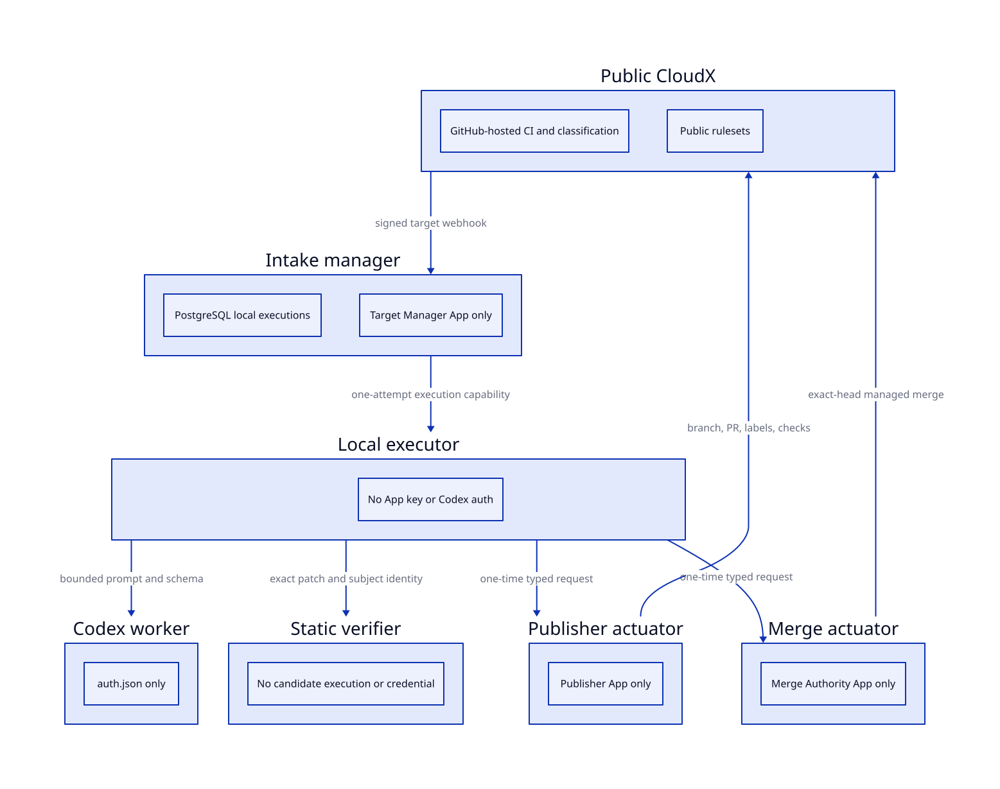

## Decision

> [!WARNING]
>
> ### Explicit unsupported-use exception
>
> CloudX V4 uses a locally logged-in Codex account because the owner
> explicitly rejected API-key authentication. OpenAI’s account-auth
> automation guide says not to use this workflow for public or
> open-source repositories. V4 therefore fails closed unless the
> operator records the explicit risk acceptance. The controls below
> reduce repository and host exposure; they do not make this use
> officially supported.

Privileged AI execution moves out of GitHub Actions. Public CloudX keeps
GitHub-hosted CI, classification, and free public-repository rulesets. A
private source repository supplies reviewed controller code, but the
host’s root-owned exact SHA and source digest are the runtime trust
anchor.

## Authority Boundaries

| Owner | Authority | Credential |
|----|----|----|
| Intake manager | Signed webhook intake, exact subject reads, durable execution state | Target Manager App |
| Local executor | Fixed plans, workspace lifecycle, cancellation, typed routing | Local execution capability |
| Codex worker | One serialized schema-bound model call | File-backed ChatGPT auth |
| Static verifier | Exact patch, subject, base, path, and model-review validation before publication | No GitHub or model credential |
| Publisher actuator | Candidate branch, pull request, labels, and checks | Candidate Publisher App |
| Merge actuator | One exact-head managed merge after live authorization | Merge Authority App |

Each authority receives only the credential required for its fixed
operation.

The model sees a controller-generated bounded context through standard
input. Repository instructions, hooks, plugins, MCP configuration,
credential files, links, special files, binary content, and oversized
content cannot become model authority. Codex runs in one serialized
stream with an ephemeral read-only sandbox, ignored user and repository
rules, no shell tool, a fixed model configuration, an output schema, and
bounded process supervision.

## Execution Contract

- The manager creates one deduplicated execution bound to the target
  identity, controller commit, controller source digest, and bounded
  payload.
- One executor claims the execution once, heartbeats its lease, and
  moves it through fixed controller-owned stages.
- An expired claimed or running lease becomes uncertain and requires
  explicit operator recovery; it is never automatically retried.
- Managed publication is bound to a canonical post-verification
  artifact; candidate code executes only later in public GitHub-hosted
  CI.
- Publisher and Merge actuators independently validate typed one-time
  requests and re-fetch the current subject before acting.

A current writer authorizes the exact issue revision or pull request
head before any account-authenticated model work is queued.

V4 enables managed generated-change automerge. Actorless ordinary and
protected-manual merge requests are rejected until manager admission
durably binds the authorizing human identity.

## Activation And Migration

Setup accepts one explicit reviewed 40-character controller commit and
canonical source digest. It installs a root-owned release, records an
append-only local ledger, and starts hardened service users and sockets.
It configures the three public-target Apps and CloudX public rulesets.
It also verifies that the private repository has no Actions runner,
workflow, secret, variable, or environment authority. A private tag is
informational, not a trust root.

The V4 migration refuses to switch while any V3 workflow execution or
registration state is active or ambiguous. Operators resolve those
records first. Terminal V3 audit history remains read-only; V4 does not
add a compatibility execution path.

## Proof Status

> [!IMPORTANT]
>
> ### Code complete is not host activated
>
> Repository tests, migration integration, static systemd verification,
> Compose checks, coverage, security review, and exact pushed commits
> are required before release. Account-authenticated live probes are a
> separate attended gate after explicit risk acceptance. Until those
> probes pass, V4 is implemented but not activated.

## Source Gaps

### live_v4_activation

Missing claim: V4 is installed and has completed account-authenticated
generation, review, verification, publication, and exact-head merge
probes on the live host.

Why missing: Implementation and deterministic verification precede
attended host activation. The account-authenticated live probes require
explicit owner risk acceptance and must not run as part of ordinary
repository tests.

Needed source: Installed-service isolation probes, two serialized
logged-in Codex jobs, cancellation and no-network verifier probes,
read-only GitHub retirement inspection, and a disposable exact-head
end-to-end run.

Blocks output: `false`
