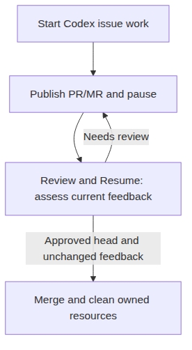

# Forge Workers

## Configure

Forge Workers runs on CloudX’s Linux host and tracks one configured
GitHub or GitLab repository. Create a Forge Workers tab, then open
Settings and complete the Forge fields.

Set the provider, repository path, local checkout and issue target
branch. Use `https://api.github.com` for GitHub, an enterprise endpoint
ending in `/api/v3`, or a GitLab endpoint ending in `/api/v4`. Both
fetch and push origins must identify that repository.

The checkout’s parent must be an allowed CloudX root because workers
create sibling worktrees. Configure Git authentication for fetch/push
separately from the plugin’s API credentials.

Create templates in Rules / Skills, then choose **Issue worker
template** and **Review template** by name in Settings. Set the worker
time limit in minutes.

Configure both worker and reviewer credentials. Use distinct application
or bot identities when review comments should appear under a different
account; public configuration omits stored secrets.

For GitHub, choose **GitHub App installation** and enter that role’s
client ID and numeric installation ID. Use **Import from file** for its
RSA private-key PEM file (up to 64 KB), then **Save** to apply it.
Install the app on the repository and grant the operations that role
needs; Forge exchanges the signed JWT for installation tokens. See
[GitHub installation
authentication](https://docs.github.com/en/apps/creating-github-apps/authenticating-with-a-github-app/generating-an-installation-access-token-for-a-github-app).

For GitLab, create separate bot/access tokens with `api` scope and the
project permissions needed by each role, then choose **Bot / access
token**. [GitLab project access
tokens](https://docs.gitlab.com/user/project/settings/project_access_tokens/)
create associated bot users. **GitLab OAuth application token** accepts
an already issued token; this plugin has no OAuth sign-in or refresh
flow.

## Work on an issue

Filter Issues with GitHub qualifiers such as `is:open label:bug`, or
GitLab parameters such as `state=opened&labels=bug`. Select an issue and
click **Start work**. Use Workers to inspect status, open the Codex tab,
pause, stop or resume.

The agent implements and commits the change. Forge publishes the branch,
opens the PR/MR, pauses and sends a ready-for-review notification. Pause
and Stop retain unfinished issue work.

After review, click **Resume**. Codex assesses the latest issue and
PR/MR comments. Completion merges only when the current head is approved
and mergeable, discussions are resolved, and feedback still matches the
agent’s input. New feedback or missing approval causes another review
pause.



After merge, Forge removes its owned checkout, local branch and worker
artifacts. Ownership changes, dirty files or a local commit different
from the published head block cleanup and preserve the resources.

## Review PRs and MRs

Select a request and click **Review** to retain a draft, or **Review and
post** to publish automatically. Reviewers use the selected request’s
exact head and actual target branch. Their temporary Codex tab and
checkout are removed when the review finishes.

The request badge shows suggested comments. Open the request, edit the
review summary, outcome and comments, then **Save draft** or **Submit
review**. Inline comments also expose file, line and diff side. **Mark
as approved** and **Mark as request changes** submit directly through
the reviewer identity.

## Recovery and limits

| State | Action |
|----|----|
| awaiting_review | Review the PR/MR, then Resume. |
| paused / stopped | Resume when ready to continue. |
| failed | Inspect the error and retained work before resuming. |
| cleanup_failed | Resolve the ownership or process error before Clean up. |
| post_failed | Inspect the provider; the saved submission cannot be posted again. |

Visible states require explicit action.

Restart recovery consults persisted workspace and tab ownership. If a
terminal disappeared without verified process quiescence, Forge
preserves its resources and reports `cleanup_failed`. Inspect the
process and ownership state; automatic cleanup is unavailable until
those checks can succeed.

A changed request head invalidates an old review draft. An ambiguous
review submission remains read-only: inspect already published comments
before starting another review. Uncertain PR/MR creation checks for an
existing request on the worker branch and refuses to repeat an
unconfirmed creation.

## Verification

Recorded checks on 2026-09-07 passed the following; the full suite,
typecheck and build include all production additions.

| Command | Result |
|----|----|
| `npx vitest run --maxWorkers=2 --reporter=dot` | 114 files, 2,137 tests passed |
| `npm run build` | Passed |
| `npm run typecheck` | Passed |
| `npx playwright test --reporter=line` | 12 shipped-shell desktop/mobile checks passed |

Recorded repository checks.

The initial `npm test -- --reporter=dot` run had two failures in
existing tests. The later full pass used `--maxWorkers=2`; the runs did
not use identical concurrency.

The settings follow-up passed **14 tests in 3 files**. Production PTY
integration passed **2 lifecycle scenarios**: issue work through fresh
feedback, approval, merge and cleanup; and review cleanup followed by
edited draft submission.

``` bash
npx vitest run apps/web/src/ui/SettingsDialog.test.ts apps/web/src/ui/SettingsDialog.import.test.ts apps/server/src/forge/ForgeSettingsService.test.ts
npx vitest run apps/server/src/forge/ForgeLifecycle.integration.test.ts
```

The lifecycle tests use real Git worktrees and terminal processes with a
deterministic assistant and local provider fixture. Live GitHub/GitLab
authentication, actual Codex model execution and issue-to-merge
operation against a hosted provider have not been tested.
