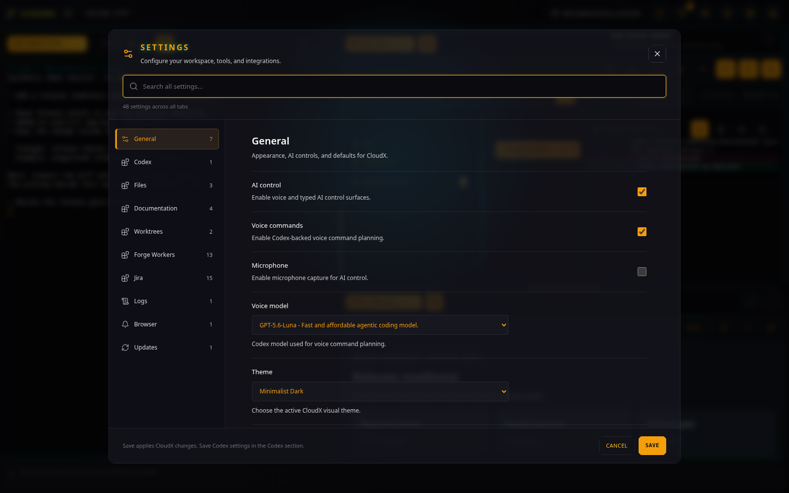
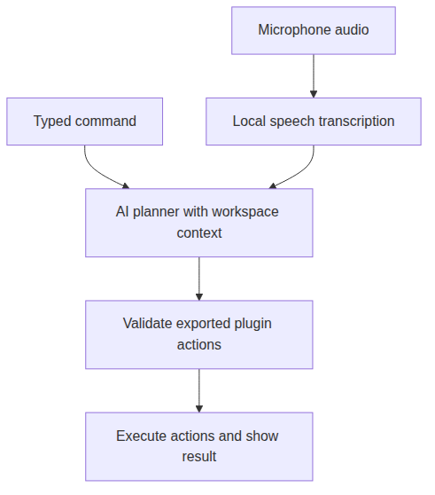

# Audio AI

[All plugins](README.md)

## Purpose and access

Audio AI supplies the typed command console and microphone controls. Use
it to steer the workspace while keeping the active task in view. It has
no workspace tab.

The demo opens the settings controls without recording audio or sending an AI command.

Speech transcription and command planning are separate steps.

## Use typed commands

Command planning requires Codex CLI installed and authenticated on the
CloudX host. Follow the [setup guide](../SETUP.md) before enabling AI
control.

In **Settings \> General**, enable **AI control** and **Voice
commands**, then select **Save**. Enter a command in **Voice
transcript** and press Enter; Shift+Enter inserts a newline. The
Microphone switch can remain off for typed commands.

For example, name a window “Release review”, then enter “switch to the
Release review window.” [Workspace Controls](workspace-control.md)
supplies the navigation actions.

## Use the microphone

Start the ASR service using the [setup
guide](../SETUP.md#faster-whisper-large-model). Enable **Microphone**,
grant browser microphone access, and use **Record voice command**. Use
**Stop voice command** to finish; **Select microphone** chooses an input
device.

Microphone capture requires a secure browser context. Use the configured
HTTPS URL for access from another device. See [HTTPS and microphone
access](../SETUP.md#https-and-microphone-access).

## Scope

The controller validates proposed actions against exported plugin
schemas. This does not make a terminal command harmless: terminal and
file actions still affect the host. Inspect the active tab and result
when issuing commands.

CloudX desktop work does not require voice or microphone input. Turn
**Voice commands** off to hide the command console, or turn
**Microphone** off to keep typed control without recording.
