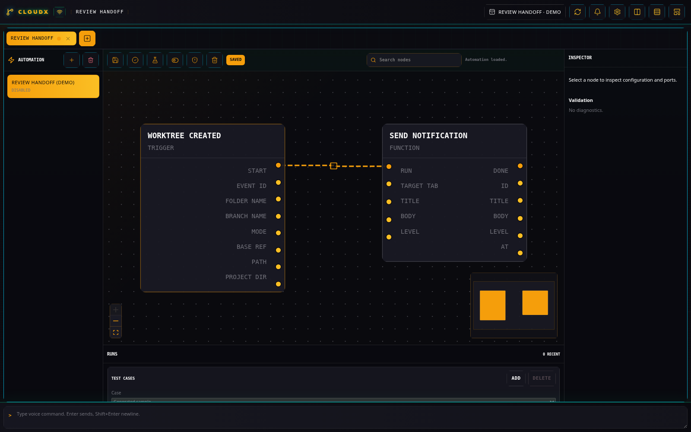
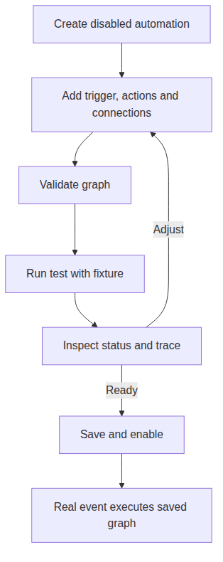

# Automation

## What it does

Automation connects workspace and plugin events to actions in a visual
graph. Use it for repeatable work with inspectable inputs, a run trace,
and saved test cases. The node catalog includes triggers, plugin hooks,
control flow, data operations, and bounded code execution.

A synthetic, disabled worktree notification flow illustrates the canvas; the Jira example below uses a separate graph.

Testing uses the graph executor; choose test actions with appropriate effects. [Diagram source](diagrams/automation.mmd).

## Set up a graph

Create an **Automation** tab. Open **Automation groups**, select **New
automation**, enter a name, and select **Create**. New automations start
disabled. Search for nodes with **Search nodes** or open the palette on
the canvas; select a node to configure it in **Automation inspector**.

Connect execution ports to define action order and data ports to pass
values. **Validate graph** reports diagnostics in the inspector. Use
**Save automation** before **Enable automation** so enabled flows use
the saved graph.

## Example: log a Jira play action

This example records a message locally when you select an issue’s play
action. It needs [Jira](jira.md) configured for a real issue, but the
graph can first run with a generated sample fixture.

1.  Create an automation named `Trace Jira selection`. Add **Jira Issue
    Play Clicked** and **Log** from **Search nodes**.
2.  Connect the trigger’s **Start** output to **Log → Run**. Set **Log →
    Message** to `Jira issue selected` in the inspector.
3.  Select **Validate graph**, then **Run test**. Open **Automation
    runs** and inspect the status and trace for `Jira issue selected`.
4.  Under **Test Cases**, select **Add** to retain a fixture. Set
    **Expected Trace Text** to the same message; run the test again.
5.  Select **Save automation**, then **Enable automation**. Return to a
    Jira issue and select its play action to generate the real event.

## Test and inspect changes

**Run test** can execute the current unsaved canvas. Its fixture and
expected status, error text, or trace text help check behavior before
enabling an edited graph. The run history shows recent outcomes, and
**Cancel run** is available for queued or running work.

A test invokes the actual graph executor and can perform its actions.
External and destructive hooks are controlled by the graph’s **Allow
external automation hooks** and **Allow destructive automation hooks**
toggles. **Run Python**, **Run Bash**, and **Run Codex Exec** require
external execution permission.

## Limits and further reading

Available nodes depend on the running server and its plugins. A flow
also needs valid configuration and any required target tabs or host
paths. Code nodes enforce process time and output limits; use [code
execution details](../AUTOMATION_CODE_EXECUTION.md) for inputs, hook
calls, and exact limits.

[Automation setup](../SETUP.md#automation-workflows) · [Jira](jira.md) ·
[Plugin guide index](README.md)
