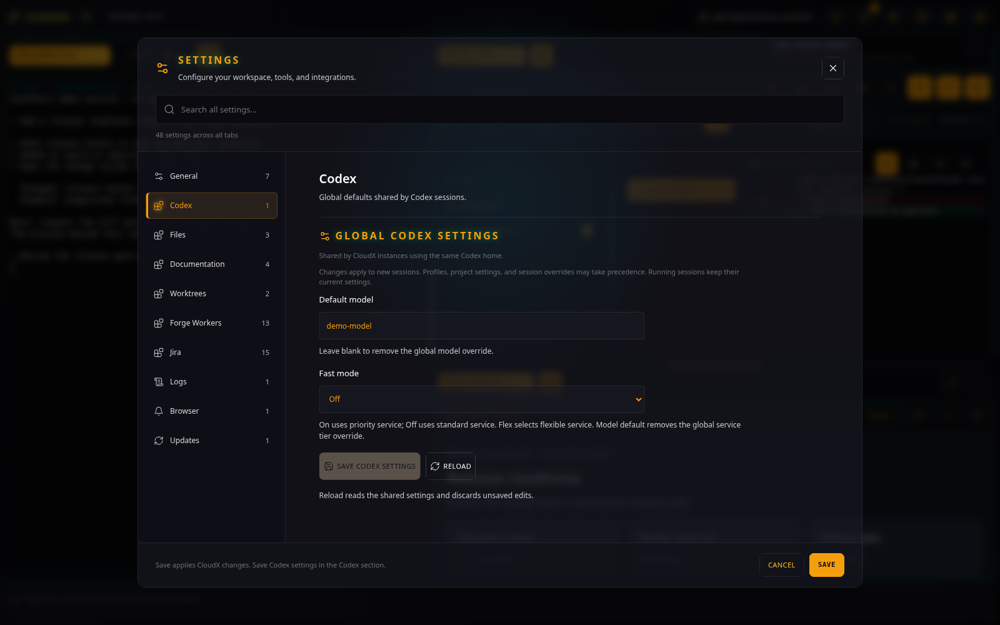
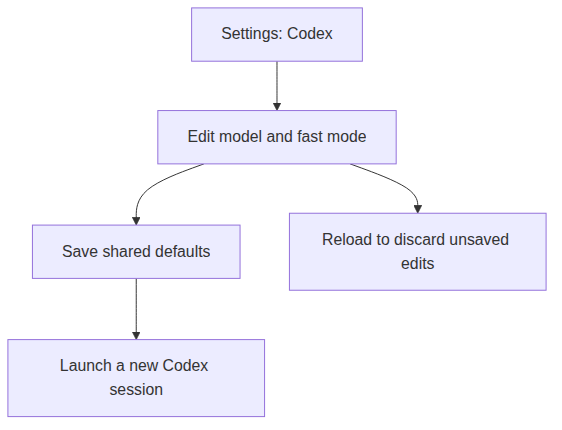

# Codex Settings

[All plugins](README.md)

## Purpose and access

Set shared defaults for future Codex sessions in **Settings \> Codex**.
This plugin does not create a workspace tab.

The demo uses a synthetic settings response; it does not read or edit a real Codex configuration.

The defaults are shared by CloudX instances using the same Codex home.
Running sessions keep their current settings; profiles, project
settings, and session overrides may take precedence.

Settings affect future launches.

## Use it

1.  Open **Settings**, then **Codex**.
2.  Set **Default model**, or leave it blank to remove the global model
    override.
3.  Choose **Fast mode**: **On** for priority service, **Off** for
    standard service, **Flex** for flexible service, or **Model
    default** to remove that override.
4.  Optionally choose **Reasoning effort**, **Web search**, and
    **Personality**. **Codex default** removes the corresponding global
    override. Reasoning efforts and personality support depend on the model.
5.  Set the session permissions and default skills described below.
6.  Select **Save Codex settings**, then open a new [Codex
    Terminal](codex-terminal.md).

For example, select a different default model before opening the next
implementation session. The terminal already reviewing your change
continues with its current configuration.

## Session permissions

**YOLO mode** bypasses Codex's sandbox and approval prompts. It starts enabled,
matching CloudX's existing launch behavior. Turn it off to let Codex use its
user and project permission settings; turning it off does not rewrite those
settings.

**Automatically trust workspace** starts disabled. When enabled, CloudX marks
the canonical working directory as trusted only in the new session's generated
configuration. It refuses an explicit untrusted workspace or enclosing directory.
The shared project's trust entries stay unchanged. Forge's repository consent
checks still apply independently.

## Default Codex skills

The list comes from the installed Codex skills. Only **imagegen** starts enabled;
other bundled skills must be selected explicitly. Save a different selection to
include those skills in future CloudX sessions. CloudX system skills and template
skills remain managed by the rules and skills catalog.

A selected skill that is removed from the installation prevents a new launch
until it is restored or disabled. Settings marks missing skills as **Not installed**
and lets you disable them.

CloudX stores its launch preferences in a managed comment in the shared
`config.toml`, alongside native Codex defaults. Codex ignores the comment,
including in strict configuration mode. Saves preserve unrelated settings and
comments and reject changes made since the editor last loaded the file.

## If saving fails

If another editor changed the shared configuration, use **Reload**,
reapply your edit, and save. Reload discards unsaved edits. Invalid TOML
must be corrected before this editor can save.
