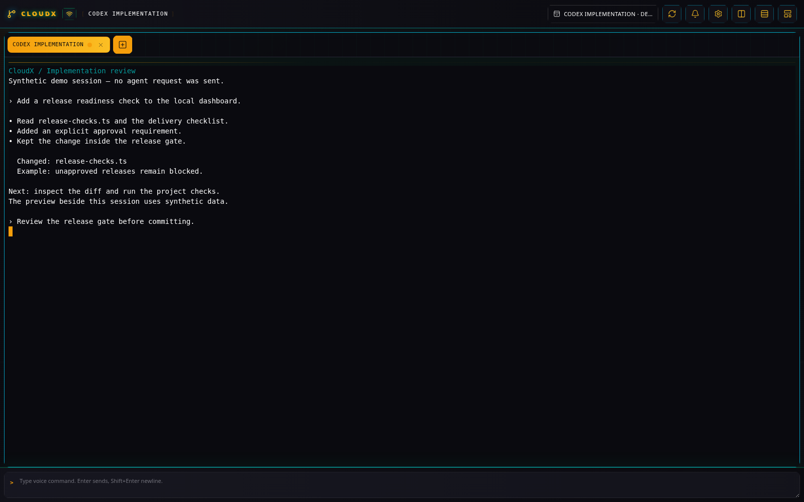
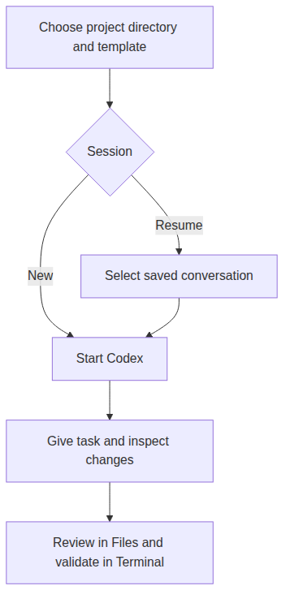

# Codex Terminal

[All plugins](README.md)

## What it does

**Codex Terminal** (`codex-terminal`, **CDX**) runs the interactive
Codex CLI in a project directory. Keep it beside Files and Terminal
panes to inspect changes and run your project’s checks while working
with the assistant.

_Codex Terminal with a synthetic demonstration transcript; no live agent request was sent._

_A Codex session works in the directory chosen for its tab._

## Before you start

Install and authenticate Codex on the CloudX server host. The terminal
service must be running, and the project directory must be inside a
configured allowed root. Follow the installation guide for service
configuration.

CloudX starts Codex with its shared launch configuration. The current
default includes `--yolo`; review the configured Codex permissions
before using a sensitive checkout. A personality template supplies the
session’s rules, skills, and Codex settings.

## Start a desktop session

1.  Open **New tab**, select **Codex Terminal**, and set **Directory**
    to the checkout you want the assistant to work in.

2.  If templates are available, choose **Template**, or keep the
    inherited selection. Leave **Session** at **New session** and select
    **Create**.

3.  Enter a concrete task in the terminal, including the intended result
    and checks to run. Use **Split columns** or **Split rows** to add a
    **Files** or **Terminal** tab for the same directory.

4.  To add a screenshot to the prompt, paste a PNG, JPEG, WebP, or GIF
    image into the Codex terminal. CloudX saves it under
    `.cloudx/pasted-images/` in the tab directory and inserts an `@`
    file reference.

## Resume and lifecycle

Choose **Resume picker** to select a saved conversation, **Resume last**
for the latest one, or **Resume ID** and enter a saved session UUID or
name. Picker and last modes can include **All directories** and
**Include exec sessions**.

Browser reloads and CloudX web-server restarts can reattach the existing
terminal while the independent terminal service stays running. Stopping
that service or rebooting stops its processes. Resuming a saved
conversation starts Codex from its history; it does not restore a
running shell process.

Closing the terminal tab stops its process. Use [Files](file-browser.md)
to review the resulting changes and [Terminal](standard-terminal.md) for
independent commands. [Rules & Skills](rules-skills.md) explains
personality templates.
