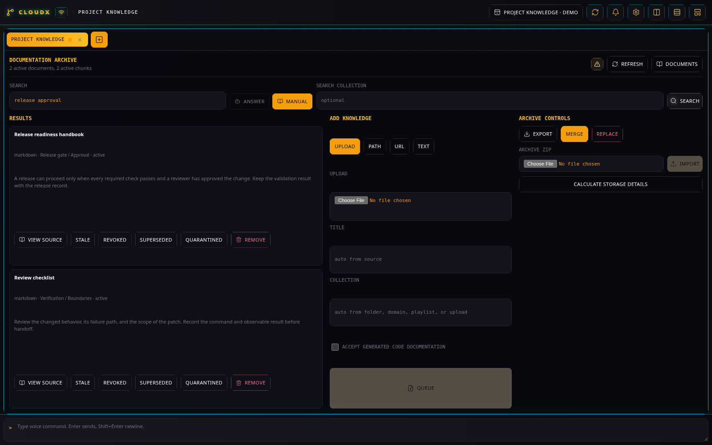
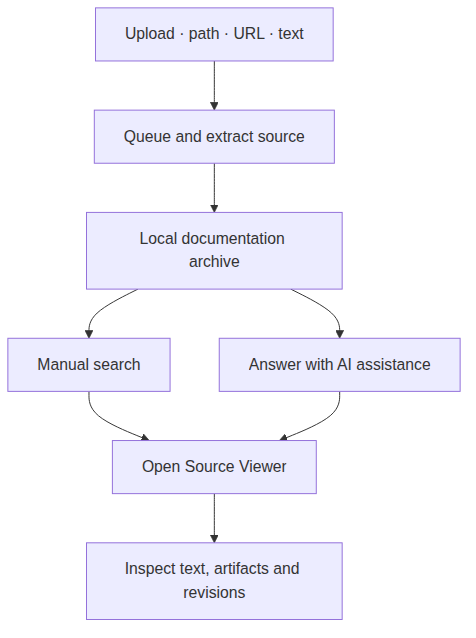

# Documentation

## What it does

Documentation keeps source material in a local archive so you can search
it during engineering work. Import a runbook, vendor PDF, website or
recording; inspect extracted text and artifacts; then reuse the evidence
in later research.

Synthetic runbook sources demonstrate Manual search with AI assistance disabled.

Both search modes let you inspect the retained evidence. [Diagram source](diagrams/documentation.mmd).

## Set up

Create a **Documentation** tab. The local documentation indexer must be
running. For a source checkout, run `npm run documentation:setup` once,
then `npm run documentation:start`; the default endpoint is
`http://127.0.0.1:7820`. See the [service setup
guide](../SETUP.md#documentation-archive-service) for installation and
startup details.

In **Settings → Documentation**, **AI enrichment** controls background
enrichment after extraction. **Answer** also requires global AI control.
**Manual** search remains available when AI assistance is disabled.

## Example: make a release runbook searchable

1.  Open **Add knowledge** and choose **upload** for a file on your
    computer, **path** for a file or folder on the CloudX host, **url**
    for an online source, or **text** for copied notes.
2.  Select the original runbook file. Set **Collection** to
    `release-operations` and leave **Title** blank to derive it from the
    source. Select **Queue**.
3.  Watch **Import Queue** until the import finishes. Search for a term
    actually present in the runbook, with **Search Collection** set to
    `release-operations`.
4.  Use **Manual** to read matching snippets, or **Answer** to ask a
    question about the imported material. Open a result in **Source
    Viewer** and inspect the underlying chunks and extracted artifacts.

This example uses your own document; its results depend on the material
you import. Retain the original file when available so extraction can
preserve more than a pasted text excerpt.

## Maintain the archive

Use **Reanalyze** (shown as **Reanalyze and enrich** with AI enabled) to
rebuild extraction from the archived source. **Re-enrich** keeps the
extracted source and reruns AI enrichment. Revision controls inspect
changes to the original source; see [Documentation
lifecycle](../architecture/documentation-lifecycle.md) for revision
checks and recovery.

Open **Archive** to **Export** a portable ZIP. Choose **merge** to add
missing records from an archive, or **replace** to replace the current
archive after entering the required confirmation. Wait for export
completion and select **Download archive**. See [portable archive
operations](../SETUP.md#portable-export-import-and-restore).

## Limits and troubleshooting

Local **path** imports must be inside the configured allowed roots. Long
imports and index initialization can take time; use queue progress and
**Refresh archive** to distinguish ongoing work from an error. During
initialization, the indexer reports that it is not ready.

A source check needs an original URL or local path. Uploaded files and
copied text without that reference need a new import to capture a newer
version. Media evidence includes transcripts and selected frames; it is
not a complete visual record of a video.

[Plugin guide index](README.md) · [Archive
architecture](../architecture/documentation-lifecycle.md) ·
[Schematics](../architecture/documentation-schematics.md)
