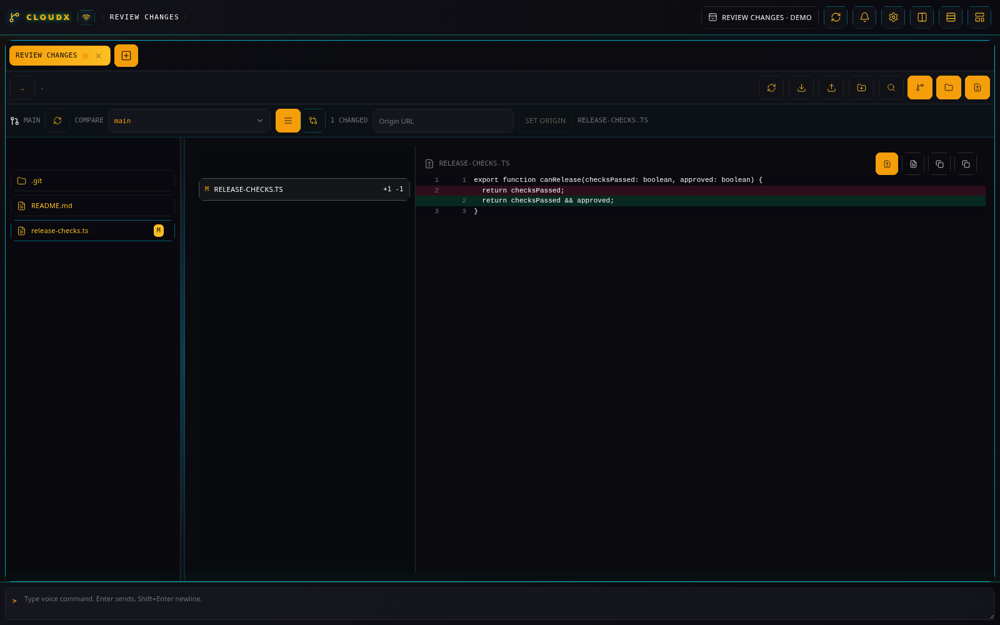
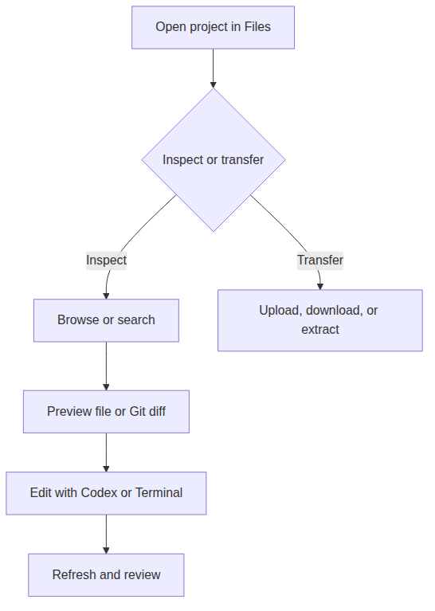

# Files

[All plugins](README.md)

## What it does

**Files** (`file-browser`, **FB**) browses the tab’s working directory,
previews text, Markdown, images, and PDFs, and displays Git changes. It
also provides search, uploads, downloads, folder creation, and archive
extraction.

_Files renders the actual diff in the isolated demo repository._

_Files combines project inspection and transfers in one pane._

## Inspect a checkout

1.  Open **New tab**, select **Files**, set **Directory** to your
    checkout, and select **Create**.

2.  Open folders in the tree and select a file to preview it. Use **..**
    to move up within the tab’s root and **Refresh** after an external
    change. The tree divider resizes the file list.

3.  Open **Show search bar** and search names, contents, or both. Search
    starts at the tab root; the expanded controls include a glob filter
    for narrowing files.

4.  For Markdown, switch between **Rendered Markdown preview** and
    **Markdown source**. A text preview reads at most 512,000 bytes; the
    preview marks truncated content.

## Review Git changes

With **Show Git diff** enabled, the Git bar shows the branch and a
**Compare** selector. Choose a comparison, open a changed file, and
switch between **Unified diff view** and **Split diff view**. Changed
files can switch between their diff and file preview.

For a folder without a repository, the Git bar offers **Init** and, when
the folder is empty, **Clone**. **Set origin** appears when available.
Use a [Terminal](standard-terminal.md) tab for commits and other Git
commands.

## Move files and configure the panel

Use **Upload files** to add selected files to the current folder. Use
the download selector for several files or folders, or right-click an
entry and choose **Download**. **New folder** creates a directory under
the current folder.

Right-click a `.zip`, `.tar`, `.tar.gz`, or `.tgz` archive and choose
**Extract here** or **Extract to …/**. These operations write to the
selected project directory.

The toolbar can hide the search bar, Git bar, tree, or changed-file
list. Plugin settings control **Show Git diff**, **Git auto-refresh**,
and **Git refresh frequency**; automatic Git refresh defaults to 15
seconds.

The desktop file preview is read-only; use Codex or Terminal to edit.
File operations stay under the tab directory and configured allowed
roots, and symbolic-link file paths are rejected.
