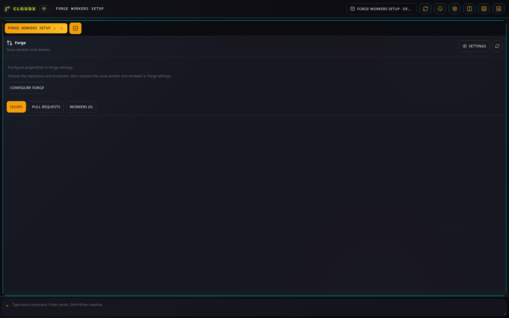
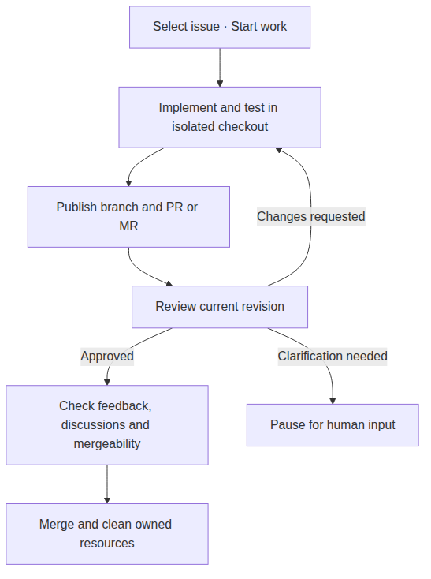

# Forge Workers

## What it does

Forge Workers turns GitHub or GitLab issues into Codex implementation
work and reviews pull or merge requests. It creates isolated checkouts,
tracks each worker, publishes completed issue work, and coordinates
review feedback. The **Issues**, **Pull requests** or **Merge
requests**, and **Workers** sections keep the workflow together.

Forge setup screen from the isolated demo. No provider account is connected.

Auto review coordinates the loop; manual work pauses for review and Resume. [Diagram source](diagrams/forge.mmd).

## Set up

1.  Create implementation and review templates in [Rules &
    Skills](rules-skills.md).
2.  Open **Settings → Forge Workers**. Set **Provider**, **API URL**,
    **Repository**, **Target branch**, **Issue worker template**, and
    **Review template**. Choose model settings and **Worker time limit
    (minutes)** for your work.
3.  Save the repository settings, then reopen settings to connect the
    identities. A Forge tab is not required for setup.

For GitHub, use **Connect issue worker** and **Connect reviewer**
separately, then finish each app registration and repository
installation in GitHub. For GitLab, the UI requires version 18.11 or
later and a one-time setup token with `api` scope from a project
Maintainer or Owner; select **Create GitLab bot connections**. Follow
the [complete connection
guide](../implementation/forge-workers.md#configure) for permissions and
renewal.

## Example: resolve a bug with a review pause

1.  Create a **Forge Workers** tab. In **Issues**, find a bug with
    reproducible steps and acceptance criteria. GitHub filters use
    search qualifiers such as `is:open label:bug`; GitLab filters use
    URL query parameters such as `state=opened&labels=bug`.
2.  Select the issue and leave **Auto review** off for a manual review
    pause. Select **Start work**.
3.  Open **Workers** to inspect progress. **View worker** opens the
    terminal overlay; closing the overlay leaves the worker running.
4.  After publication, inspect the PR/MR and its reported validation.
    Review it, then select **Resume** on the issue worker to process the
    latest feedback.

Resume can merge completed work when the current head is approved and
mergeable, discussions are resolved, and feedback still matches the
worker’s input. Enabling **Auto review** coordinates coding, review,
corrections, and the eligible merge automatically; a clarification
request pauses the loop.

## Review an existing request

Select a PR/MR and choose **Review** to retain a draft, or **Review and
post** to publish automatically. Inspect the current draft summary,
outcome, and comments; use **Save draft** or **Submit review**. Earlier
rounds remain read-only history. A changed head invalidates an old
draft.

## Limits and recovery

Forge tracks one configured repository on the Linux host. Changing its
settings does not retarget existing workers. **Pause** and **Stop**
retain unfinished issue work; inspect errors before **Resume**.
Uncertain publication or review submission requires inspection rather
than blindly posting again.

Use the [worker guide](../implementation/forge-workers.md) for
conflicts, permissions, restart recovery, and cleanup behavior. [Forge
diagnostics](../SETUP.md#forge-diagnostics) explains the logs. [Plugin
guide index](README.md).
