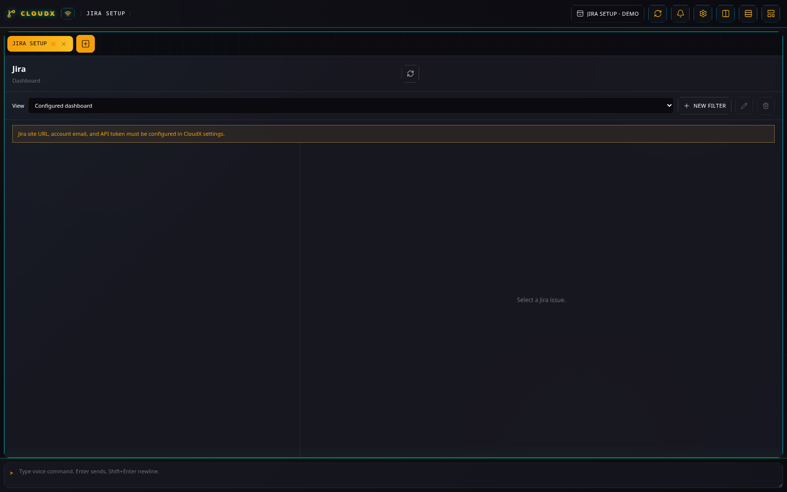
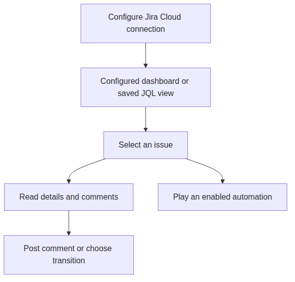

# Jira

## What it does

Jira brings a Jira Cloud work queue into the desktop workspace. Read
issue details and comments beside your terminal, select a workflow
transition, and post a comment without leaving the issue panel. Saved
views keep recurring JQL queries available in CloudX.



Jira setup screen from the isolated demo. No Jira account is connected.



Saved views select the queue; issue actions work on the selected ticket. [Diagram source](diagrams/jira.mmd).

## Set up

Open **Settings → Jira** and enter **Jira site URL**, **Jira account
email**, and **Jira API token**. Use your HTTPS Jira Cloud site, such as
`https://example.atlassian.net`. Save the settings, then create a
**Jira** tab. CloudX stores the token outside `config.json` and omits it
from public configuration responses.

The configured dashboard shows assigned issues. **Dashboard filter JQL**
adds a condition to that query; **Dashboard sort** and **Dashboard
grouping** control presentation. Grouping defaults to **Epic**. A saved
filter instead supplies the complete query.

## Example: keep a personal release queue

1.  Select **New filter** and name it `My release work`.
2.  Enter the complete JQL below and select **Save filter**. Include a
    real project key if you want to narrow it further.
3.  Select the saved view under **View**, then open an issue to inspect
    its description, status, priority, Epic, assignee, and comments.
4.  When you have a concrete update, enter it in **Add a Jira comment**
    and select **Add comment**. Choose a button under **Transitions**
    only when you intend to change the Jira issue’s workflow state.

```jql
assignee = currentUser() AND resolution = EMPTY ORDER BY updated DESC
```

Saved filters live in CloudX. They do not create Jira server filters,
and they do not automatically restrict results to your assignments: the
example includes that condition explicitly. Use **Refresh Jira** to
reload the current view.

## Connect an automation

The issue play action emits **Jira Issue Play Clicked** for enabled
automations listening to that trigger. Start with the [Automation trace
example](automation.md#example-log-a-jira-play-action) to verify the
connection before adding other actions.

For background events, enable **Jira polling** in settings and set
**Polling project keys** or a narrow **Polling filter JQL**. Polling can
detect new or updated issues, status changes, assignments, and comments.
Polling is disabled by default; the dashboard refresh interval is a
separate setting.

## Limits and further reading

This integration targets **Jira Cloud**. Visible transitions come from
the selected issue’s current workflow; a project’s required fields and
permissions can prevent a requested change. Inspect the returned error
and the issue in Jira before trying another action.

[Connection and polling details](../SETUP.md#jira-cloud-integration) ·
[Automation](automation.md) · [Plugin guide index](README.md)
