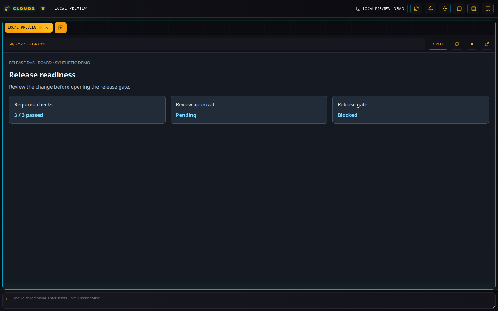
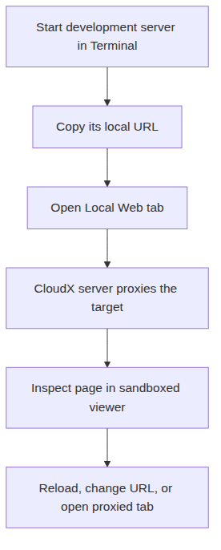

# Local Web

[All plugins](README.md)

## What it does

**Local Web** (`local-web`, **WEB**) embeds a local website or dashboard
in a CloudX pane. Use it beside Codex, Files, and Terminal to inspect a
running development preview without leaving the workspace.

_Local Web displays a local release dashboard populated with synthetic demo data._

_Local Web displays the server you start; it does not launch that server._

## Open a development preview

1.  Start your application’s development server in a
    [Terminal](standard-terminal.md) tab or another process on the
    server host. Keep that process running and copy the URL it reports.

2.  Open **New tab**, select **Local Web**, and enter the complete
    **URL**, for example `http://127.0.0.1:5173`. Include the query
    token if your local dashboard requires one. This plugin does not
    require a directory.

3.  Select **Create**. The toolbar’s **Local website URL** field and
    **Open** button let you change the address later.

4.  Use **Reload viewer** to reload the page, **Clear URL** to empty the
    pane, or **Open proxied view in a new browser tab** for more space.

## Addresses and access

CloudX fetches the target through its server proxy. A URL containing
`127.0.0.1` or `localhost` therefore addresses the CloudX server host,
including when you open CloudX from another computer.

Plain HTTP is accepted only for localhost and loopback addresses. LAN
and tailnet targets require HTTPS. Supported hosts include private IP
addresses, local hostnames, and `.ts.net` names; public websites,
embedded username/password credentials, and link-local or cloud-metadata
addresses are rejected.

The full URL, including query tokens, is kept in the viewer state. Query
strings and fragments are removed from the URL supplied to voice
context.

## Operational limits

Local Web is a viewer: clearing or closing it does not stop the
development server. Stop that process from its owning Terminal or
service when you finish.

The embedded page runs in a sandboxed frame. The proxy supports HTTP
requests and WebSockets, but it is not a general browser session: its
forwarded request headers omit browser cookies and Authorization. Apps
that depend on those credentials may need a separate direct browser
session.

A failed upstream request appears as a proxy error. Check that the
server is still running, that its URL is reachable from the CloudX host,
and that the address follows the rules above.
