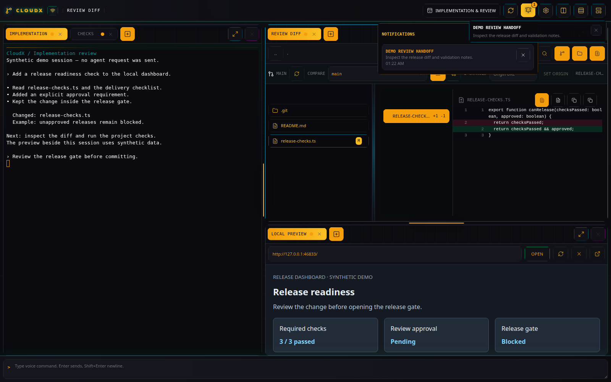
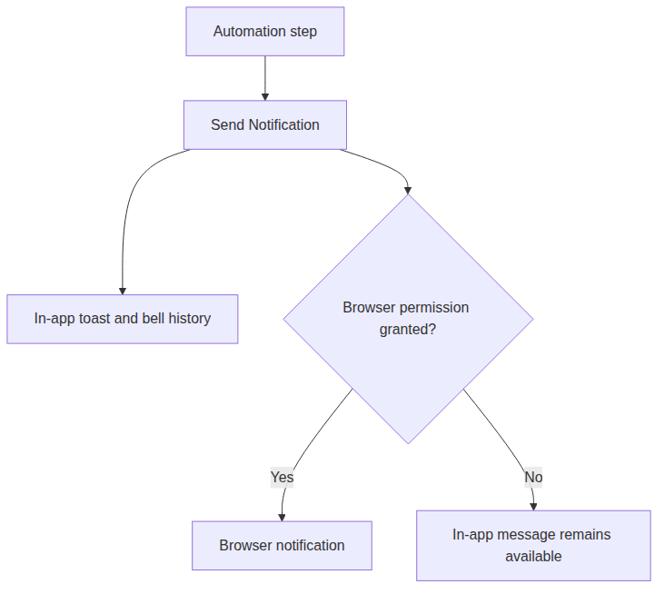

# Notifications

[All plugins](README.md)

## Purpose and access

Notifications lets automation record local status messages through
**Send Notification** (`notifications.send`). The toolbar bell opens the
history; this plugin does not create a tab.

A local demo hook creates this message; no external notification provider is used.

Browser alerts are optional; the app keeps its own notification history.

## Use it

1.  In an [Automation](automation.md) graph, add the **Send
    Notification** hook after the work you want to report.
2.  Set a non-empty `title`; optionally supply `body` and `level`
    (`info`, `success`, `warning`, or `error`).
3.  Run the graph and open the toolbar bell to inspect the message.
4.  Use **Dismiss** on a message or **Dismiss all notifications** to
    clear the history.

For example, use title “Review ready”, body “The release notes are ready
to inspect”, and level `success` after a successful review-preparation
step. This message describes the workflow result; it does not publish
the review.

## Retention and browser alerts

The server retains the latest 50 notifications in memory. A browser
reload can retrieve that history while the server remains running; a
server restart clears it. Notifications are not a durable audit log.

Use **Settings \> Browser** to request browser notification permission.
Browser alerts require permission and a secure context; in-app
notifications remain available without that permission.
