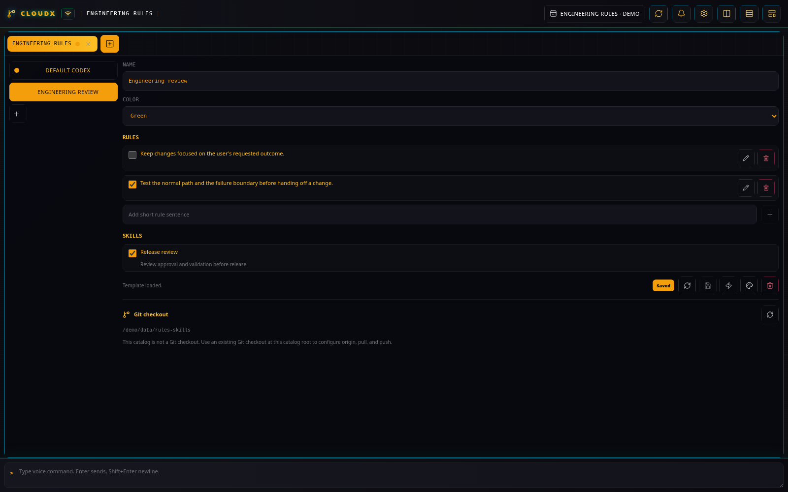
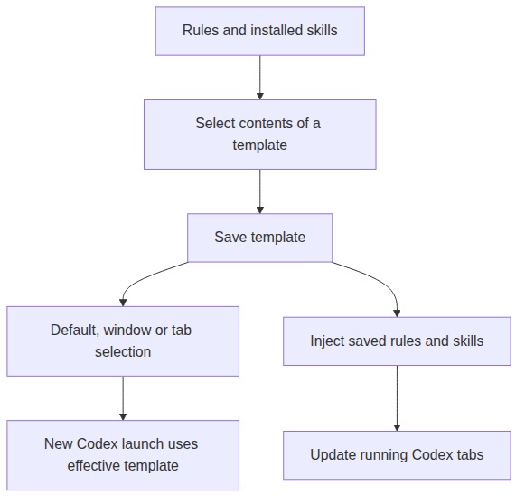

# Rules & Skills

## What it does

Rules & Skills packages Codex instructions into reusable personality
templates. A template selects short rules and installed skills, with a
name and color. Use separate templates for implementation, review, or
research, then choose the appropriate template for a window or Codex
tab.

A synthetic Engineering review template shows rule selection and the saved state.

Saving a template and injecting it into running sessions are separate actions. [Diagram source](diagrams/rules-skills.mmd).

## Create a reviewer template

1.  Create a **Rules & Skills** tab. In **Templates**, select **Create
    template**.
2.  Set **Name** to `Reviewer` and choose a **Color**.
3.  In **Add short rule sentence**, enter a rule such as
    `Report reproducible failures and explain their user impact.` Select
    **Add rule**. The new rule is enabled in this template and saved
    with it.
4.  Select installed skills relevant to your review workflow. Select
    **Save template** after changing selections.

The example rule expresses a review preference; it does not enforce
repository policy by itself. The picker lists skills already in the
catalog. To add one, use the **Create CloudX Skill** or **Migrate Skill
To CloudX** skill from a Codex session; both work with the folder-backed
catalog exposed through `CLOUDX_RULES_SKILLS_DIR`.

## Choose where the template applies

Use the window’s **Template** field to give new work in that window a
shared selection. In the new Codex tab form, **Template** can inherit
that selection or override it. **Set default** in Rules & Skills changes
the catalog default. A tab selection takes precedence over its window
selection, which takes precedence over the default.

Saving edits updates the catalog. To update running sessions, first save
the template, then select **Inject saved rules and skills**. The action
applies each running Codex tab’s effective template; the selected editor
template does not replace every tab’s choice.

Forge selects **Issue worker template** and **Review template**
separately in its settings. See [Forge Workers](forge.md) for the issue
and review workflow.

## Share the catalog through Git

The **Git checkout** section displays the catalog directory and branch.
For a catalog that is already a Git checkout, set **Origin URL** and
select **Save origin**. **Pull** fast-forwards a clean checkout from the
same-named branch on origin and reloads the catalog.

Save or discard editor drafts, and commit or discard local catalog
changes before pulling. **Push commits** sends existing commits to the
same branch; it does not create a commit or force a push. If the catalog
is not a Git checkout, prepare that checkout locally before using these
controls.

## Limits and further reading

Missing rules or skills must be restored or deselected before saving a
template. Templates share catalog rules, so editing a rule changes the
saved rule used by every template that selects it. Save/inject
deliberately when updating sessions already doing work.

[Codex startup and generated
configuration](../SETUP.md#codex-session-sources-and-startup) · [Forge
Workers](forge.md) · [Plugin guide index](README.md)
