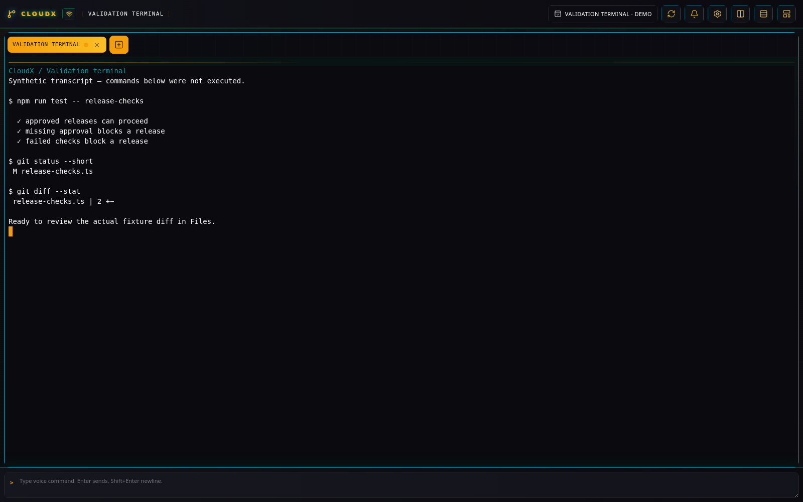
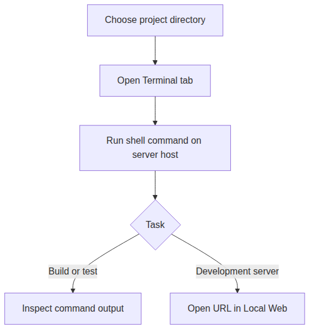

# Terminal

[All plugins](README.md)

## What it does

**Terminal** (`standard-terminal`, **TTY**) runs the server user’s shell
in a browser terminal. Use it for builds, tests, Git commands, and
development servers alongside your Codex and Files panes.

_Terminal demonstration transcript; the displayed commands and results are illustrative._

_The shell and its commands run on the CloudX server host._

## Before you start

The CloudX terminal service must be running. Choose a working directory
inside a configured allowed root. Commands execute on the CloudX server
host, so required project tools and dependencies must be available
there.

The shell comes from `SHELL`, with `/bin/bash` as the default. Bash and
Zsh launch as login shells. Check the service environment if it cannot
find a tool installed on your host.

## Run a project check

1.  Open **New tab**, select **Terminal**, and enter the project’s
    **Directory**. Add a descriptive **Title**, such as “Build and
    tests”, then select **Create**.

2.  Focus the terminal and enter the command used by your project. For a
    CloudX development checkout, `npm test` runs the repository’s test
    command; follow the project’s own setup instructions before running
    it.

3.  Use **Split columns** or **Split rows** to keep the command output
    visible beside [Codex Terminal](codex-terminal.md) or
    [Files](file-browser.md). New tabs can use the same checkout or a
    separate worktree directory.

4.  To inspect a development server, keep its command running here and
    open its URL in a [Local Web](local-web.md) tab.

## Lifecycle and limits

A browser reload does not itself close a terminal. CloudX reconnects to
the retained process and output while the terminal service stays
running. Closing the tab stops the process; stopping the terminal
service or rebooting stops all processes it owns.

When the shell exits, its Terminal tab remains available with the final
output. Start another Terminal tab when you need a new shell.

Text paste uses the normal terminal behavior. Automatic image upload and
`@` attachment insertion belong to Codex Terminal tabs.
