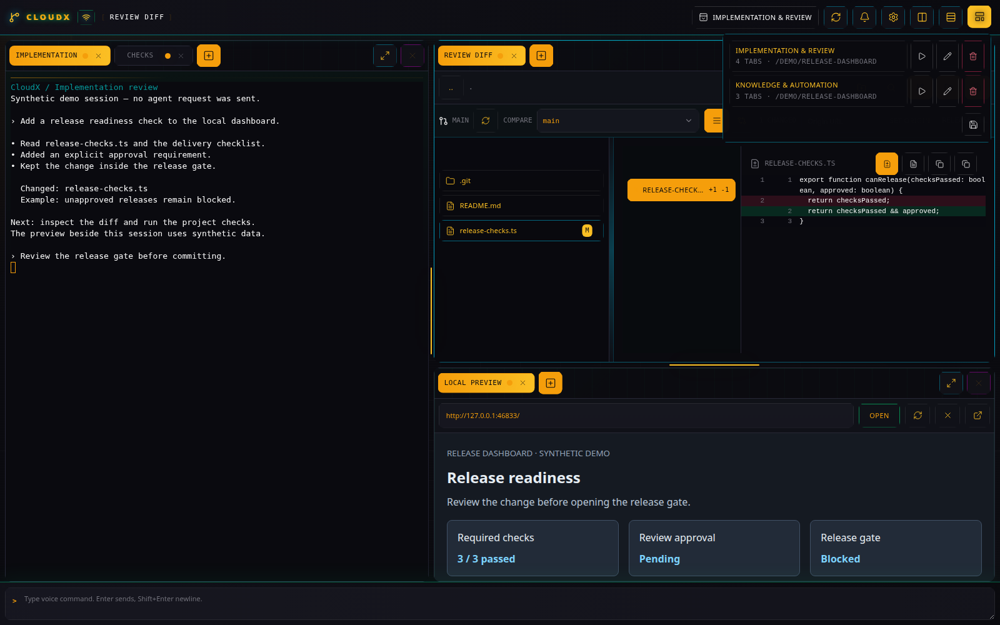
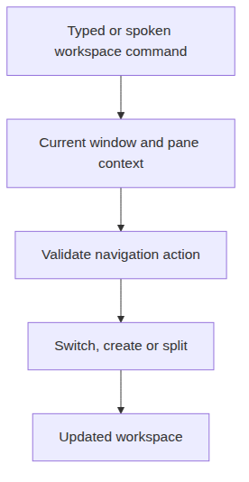

# Workspace Controls

[All plugins](README.md)

## Purpose and access

Workspace Controls lets the AI command surface switch tabs and windows,
select or split panes, and create plugin tabs. It is a supporting
plugin, so it is absent from the **New tab** list.

Two layouts saved and reloaded in the isolated demo workspace.

Navigation commands target the current workspace context.

## Use it

Enable [Audio AI](audio-ai.md), then type a command such as “switch to
the Release review window” or “open a Files tab in this project.” Use
distinctive window and tab names so the target is unambiguous.

For direct desktop navigation, open **Workspace windows** to create,
search, rename, or switch windows. Use **Split columns** or **Split
rows** and drag tabs between panes. **Maximize pane** expands one pane;
**Restore pane** restores the layout.

## Reuse a layout

Open **Layout templates \> Save current layout as template**, name it,
and select **Save template**. To reuse it, select the saved template,
set **Template project path** and **New window name**, then **Load
template**. See the [demo workspaces](../DEMO_WORKSPACES.md) for
concrete layouts.

A layout template describes panes and tabs. A [Rules & Skills
template](rules-skills.md) selects instructions for Codex; these are
separate controls.
