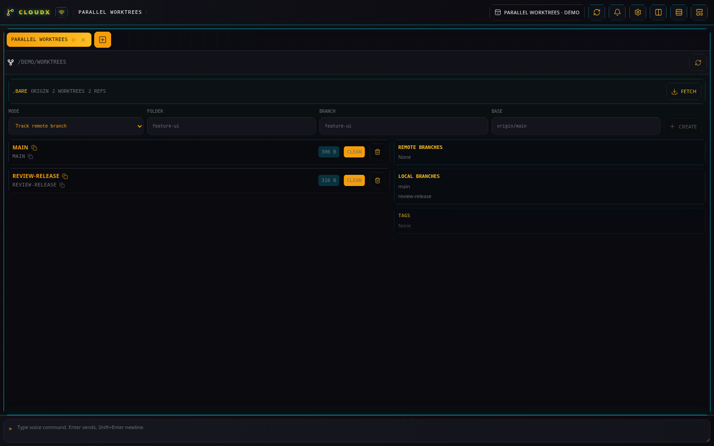
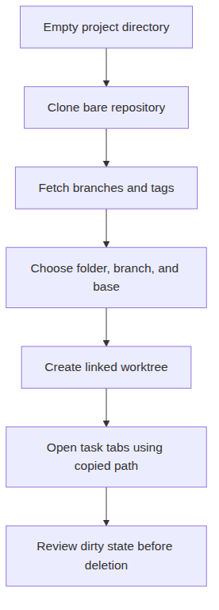

# Worktrees

[All plugins](README.md)

## What it does

**Worktrees** (`worktree-manager`, **WT**) manages a bare Git repository
and its linked working folders. Use a separate folder and branch for
each task, then point Codex, Terminal, and Files tabs at that folder.

_Worktrees shows two linked working folders in an isolated demo project._

_Each task gets a linked working folder under the bare-repository project._

## Prepare a project

Open **New tab**, select **Worktrees**, and choose a directory inside an
allowed root. Start with an empty project directory, a directory
containing one bare repository, the bare repository itself, or one of
its sibling worktrees.

For an existing remote project, enter its **Git repository URL** and
select **Clone bare repository**. CloudX creates a `.bare` repository
under the project directory and loads its refs. Git and the required
remote authentication must work on the server host.

**Initialize bare repository** creates an empty bare repository. It has
no commit refs yet; create an initial commit with Git before using a
branch-from-base workflow. A normal populated checkout without the
supported bare layout is blocked rather than converted.

## Create a task worktree

1.  Select **Fetch** to update origin branches and tags when the project
    has an origin.

2.  Choose **New branch from base**. For example, enter `search-fix` in
    **Folder**, `feature/search-fix` in **Branch**, and an available
    `origin/main` in **Base**.

3.  Select **Create**. The new folder appears in the list with its
    branch and clean or dirty state. Click the folder name to copy its
    full path, then use that path in new Codex, Terminal, or Files tabs.

Use **Track remote branch** to create a local tracking branch from a
remote ref, or **Existing local branch** to check out a local branch.
The folder must be a direct child of the project directory.

## Cleanup and limits

Each row shows **Clean** or **Dirty** status; the dirty badge describes
staged, unstaged, and untracked changes. **Show folder sizes** controls
size calculation, and **Branch prefix** can prefill a new branch name.

To remove a worktree, select its delete button and type its folder name.
Dirty worktrees also require **Force delete dirty worktree**. Deletion
removes that working folder, including uncommitted files when forced;
inspect and preserve anything you need first.

The optional play button beside **Create** runs a configured
new-worktree automation when that trigger is active. Ordinary **Create**
also emits a completed-worktree event for automation. See
[Automation](automation.md).
